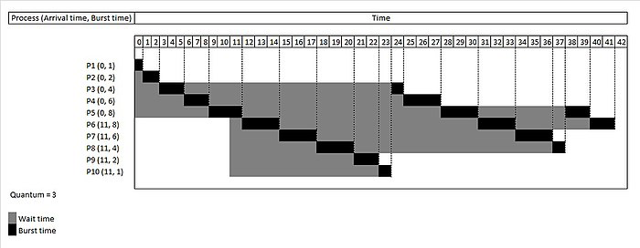
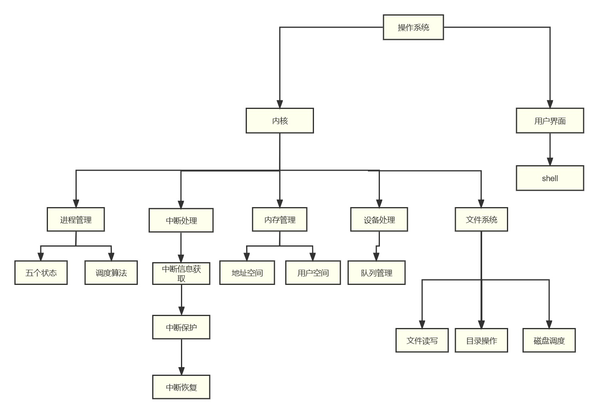
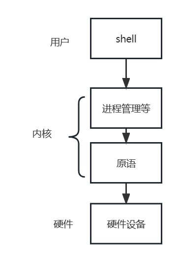
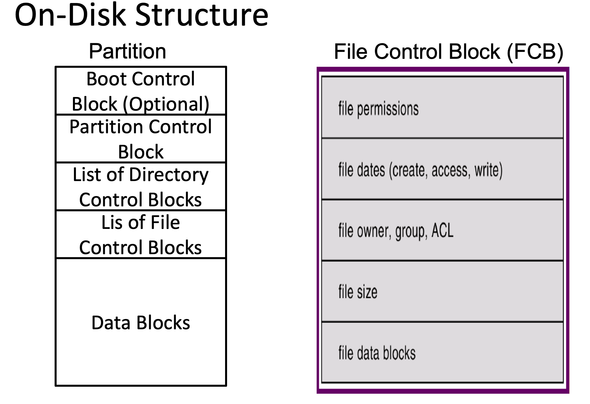
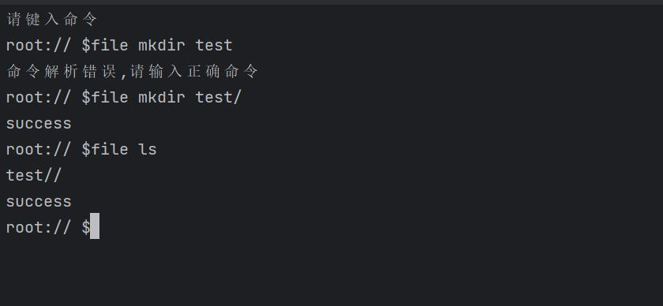

[TOC]

## 1. 总体设计

 

### 1.1 概述

 

*此项目为 2023 年春季北京邮电大学操作系统课程设计项目，题目为《操作系统模拟程序的设计与实现》，课程设计的目的在于：加深理解操作系统的基本功能、原理和工作机制，理解并掌握操作系统的实现方法和技术，培养学生理解问题、分析问题、解决问题的能力，培养学生团队合作精神、组织协调能力，进一步培养提高学生的编程实践能力。*

 

#### 1.1.1 功能描述

 

此项目设计并实现一个具有操作系统基本功能的软件，要求该软件具有操作系统的如下基本功能：

 

- 进程管理功能，如进程创建(new)、进程调度(scheduling)、进程阻塞(block)、进程唤醒(wakeup)、进程同步(synchronize)等。
- 内存管理功能，进程存储空间的分配和回收等。
- 文件系统，目录/文件的创建和删除、空间分配和回收。
- 设备管理，设备的申请、分配、使用、释放等。
- 程序运行的交互 UI 界面。
- 程序需要模拟实现操作系统的中断机制。

 

#### 1.1.2 运行环境

 

程序的运行环境为  *Windows Subsystem for Linux* (*WSL*)[^1] ，即 Windows 系统环境下安装的 Linux 虚拟机，所使用的 Linux 发型版为 [Debian 11 (bullseye)](https://www.debian.org/News/2021/20210814), 程序运行的宿主机内核版本为 Linux 5.10.16.3-microsoft-standard-WSL2  x86_64 GNU/Linux。

 

#### 1.1.3 开发环境

<<<<<<< HEAD:doc/概要设计.md
 

项目使用 VScode 代码编辑器配合 C/C++ 语言相关插件进行开发，团队使用 [Git](https://git-scm.com) 作为代码版本管理工具，代码托管在 [Github](https://github.com) 上的私有远程仓库进行协同开发，所有的代码遵循标准 GNU/Linux 系统 API[^2], 编程语言上使用 C++17 标准进行开发。
=======
项目使用 VScode 代码编辑器配合 C/C++ 语言相关插件进行开发，团队使用 [Git](https://git-scm.com) 作为代码版本管理工具，代码托管在 [Github](https://github.com) 上的私有远程仓库进行协同开发，所有的代码遵循标准 GNU/Linux 系统 API[^2], 编程语言上使用 C++17 标准进行开发。 
>>>>>>> master:概要设计.md

 

### 1.2 设计思想

<<<<<<< HEAD:doc/概要设计.md
 

总体来说，程序使用面向对象的软件工程设计思想进行开发，我们将程序模块化设计，划分为如下几个模块：
=======
总体来说，程序使用面向对象的软件工程设计思想进行开发，我们将程序模块化设计，划分为如下几个模块： 
>>>>>>> master:概要设计.md

 

1. 系统内存管理模块
2. 系统进程管理模块
3. 系统中断机制模块
4. 文件系统模块
5. 程序交互 UI 界面模块
6. 系统时钟管理 (timer) 模块
7. 系统设备管理模块

 

#### 1.2.1 软件设计构思

 

将程序设计划分为上述的几个模块，各个模块之间互相依赖写协作，共同实现操作系统的各个功能。举例来讲，操作系统的内存管理和进程管理为最基础以及最重要的模块，所有的其他模块和功能都要依赖内存管理，以及进程管理功能。与此同时系统的中断机制伴随程序的始终，现代操作系统使用中断驱动，我们将时钟管理模块(timer) 与此结合一起实现。

 

在交互 UI 界面上，程序在终端模拟一个操作系统 Shell，以及我们自己实现基本的交互指令。举例来说比如 Linux 默认的 `ls` shell 指令作用为列出当前目录下的文件功能。通过这种 Shell 指令与操作系统全程交互，实现用户对操作系统的使用和控制。

 

对于文件系统模块，设计模拟实现基本的操作系统文件增删读写功能，由于是“模拟”操作系统的功能，所以我们直接使用 Linux 系统提供给用户的底层 API，使用 C/C++ 语言自己更高级的语言特性来调用实现。

<<<<<<< HEAD:doc/概要设计.md
 

现代操作系统同时需要具有设备管理功能，在 Linux 系统下，一切设备都对应一个文件描述符，程序运行开始时刻监听设备的数量，插入已经拔出系统的各种设备等。
=======
现代操作系统同时需要具有设备管理功能，在 Linux 系统下，一切设备都对应一个文件描述符，程序运行开始时刻监听设备的数量，插入已经拔出系统的各种设备等。 
>>>>>>> master:概要设计.md

 

#### 1.2.2 关键技术与算法

 

需要考虑使用何种算法来实现的模块有内存管理模块、进程管理模块、文件系统模块。对于内存管理而言，现代操作系统常见的内存管理算法有三种：连续分区、页式和按需调页。在实现难度上，后两种都要考虑与虚拟内存的交互，但是在我们的“模拟”程序中，实现虚拟内存是内存较大的，所以目前暂定使用连续分页的机制来实现。在后续的团队协作开发进度来看，如果有更充裕的时间我们将考虑更换内存管理算法，比如使用最复杂的按需调页机制。

<<<<<<< HEAD:doc/概要设计.md
 

进程管理部分也有需要选择实现的算法，现代操作系统常见的进程调度算法比如先来先服务FCFS，时间片轮转算法(Round Robin)[^3] 算法，多级队列调度算法等。我们暂定使用时间片轮转算法来进程系统进程调度。
=======
进程管理部分也有需要选择实现的算法，现代操作系统常见的进程调度算法比如先来先服务FCFS，时间片轮转算法(Round Robin)[^3] 算法，多级队列调度算法等。我们暂定使用时间片轮转算法来进程系统进程调度。 
>>>>>>> master:概要设计.md

 

文件系统实现部分，使用树形结构等数据结构来维护实现，比如维护文件描述符，我们可以考虑使用哈希表来存储等操作。

 

#### 1.2.3 基本数据结构

 

在各种模块算法实现过程中，必然需要借助相对应的数据结构来辅助完成。在进程管理中，我们需要维护一个进程的队列，以时间片轮转算法来说，当一个进程的时间片用完后就回到队尾，队头的进程出队列进行运行，如下图所示 (图源 Wikipedia)：

 



 

在文件系统或者磁盘管理部分，数据结构也是重度依赖使用的。文件系统主要依赖 FCB[^4] 的功能实现，使用多叉树来维护文件结构。磁盘管理功能来说，常见的位示图(bitmap) ，或者使用链表来维护空闲以及被占用的磁盘块，如下图所示为使用 16 bit 序列 `0000111000000110` bitmap 维护的空闲磁盘空间：

 


 
<<<<<<< HEAD:doc/概要设计.md

### 1.3 基本处理流程

 

对于模拟一个现代的 Linux 操作系统，我们忽略掉硬件启动的部分，对于软件层面包括的处理流程主要为：

 

1. 内核启动：内核在启动时，首先会进行初始化，包括初始化内存管理、进程管理、文件系统等模块。然后，内核会启动系统的第一个进程—— systemd，systemd 会负责启动其它服务和进程。对于我们自己模拟的程序，需要自己实现一个初始化程序来初始化所有系统服务。

 

1. 服务启动：系统初始化进程会启动各种服务，例如网络服务、文件系统服务、用户服务、日志服务等。
2. 进程管理：系统使用进程来管理程序和服务，内核负责管理进程，包括创建、撤销、调度、通信和同步等操作。
3. 文件管理：操作系统通过文件系统管理文件和目录，支持各种文件系统类型和访问权限设置，包括文件的创建、读取、写入、删除、复制等操作。
4. 设备管理：操作系统会实时监听所有系统识别到的设备，同时映射为系统中的文件描述符。

 

我们的模拟程序会同时维护上述 5 个流程，以模拟实现现代操作系统的基本功能。

 

 

 

=======

### 1.3 基本处理流程 

对于模拟一个现代的 Linux 操作系统，我们忽略掉硬件启动的部分，对于软件层面包括的处理流程主要为：

1. 内核启动：内核在启动时，首先会进行初始化，包括初始化内存管理、进程管理、文件系统等模块。然后，内核会启动系统的第一个进程—— systemd，systemd 会负责启动其它服务和进程。对于我们自己模拟的程序，需要自己实现一个初始化程序来初始化所有系统服务。 
1. 服务启动：系统初始化进程会启动各种服务，例如网络服务、文件系统服务、用户服务、日志服务等。
1. 进程管理：系统使用进程来管理程序和服务，内核负责管理进程，包括创建、撤销、调度、通信和同步等操作。
1. 文件管理：操作系统通过文件系统管理文件和目录，支持各种文件系统类型和访问权限设置，包括文件的创建、读取、写入、删除、复制等操作。
1. 设备管理：操作系统会实时监听所有系统识别到的设备，同时映射为系统中的文件描述符。

我们的模拟程序会同时维护上述 5 个流程，以模拟实现现代操作系统的基本功能。

>>>>>>> master:概要设计.md
## 2. 软件的体系结构和模块设计

 

### 2.1 软件的体系结构

 

#### 2.1.1 软件体系结构框图

 
<<<<<<< HEAD:doc/概要设计.md



 

#### 2.1.2 软件主要模块及其依赖关系说明
=======


 

#### 2.1.2 软件主要模块及其依赖关系说明 
>>>>>>> master:概要设计.md

 

- 用户界面：采用一个类似于Linux的Shell页面

 

- 内核：采用大内核模式，将如下五大功能都放在内核中运行，减少变态次数，提高效率 

<<<<<<< HEAD:doc/概要设计.md
 

  \- 进程管理：包括进程的五种状态以及进程调度算法，如时间片轮询等

  \- 中断处理：当中断发生后，需要将当前进程中断，等事情发生后再运行

  \- 内存管理：包括地址空间和用户空间

  \- 设备处理：对输入输出设备队列管理

  \- 文件系统：有文件读写，磁盘调度等管理

 
=======
- 进程管理：包括进程的五种状态以及进程调度算法，如时间片轮询等
>>>>>>> master:概要设计.md

- 中断处理：当中断发生后，需要将当前进程中断，等事情发生后再运行

<<<<<<< HEAD:doc/概要设计.md
 

  

 

### 2.2 软件数据结构设计

 

#### 2.2.1 全局数据结构说明

 

首先是进程管理模块中，需要实现 [Process Table and Process Control Block (PCB)](https://www.geeksforgeeks.org/process-table-and-process-control-block-pcb/) 的全局数据结构，常见的 PCB[^5] 设计有如下几个部分：

 
=======
- 内存管理：包括地址空间和用户空间

- 设备处理：对输入输出设备队列管理

- 文件系统：有文件读写，磁盘调度等管理

  以上五大功能基于计算机系统本身的原语执行

  

 

### 2.2 软件数据结构设计

#### 2.2.1 全局数据结构说明 

首先是进程管理模块中，需要实现 [Process Table and Process Control Block (PCB)](https://www.geeksforgeeks.org/process-table-and-process-control-block-pcb/) 的全局数据结构，基本的 PCB[^5] 设计如下所示：
>>>>>>> master:概要设计.md

```C++
struct CentralProcessingUnit {
    unsigned int eax;
    unsigned int ebx;
    unsigned int ecx;
    unsigned int edx;
    unsigned int pc;
    BYTE *share_addr;//共享内存首地址
} CPU;
 
struct ShareResource {
    bool using_eax;
    bool using_ebx;
    bool using_ecx;
    bool using_edx;
} CPU_flag;
 
//PCB表结构
typedef struct ProgramControlBlock {
 
    int pid;            // pid
    int slice_cnt;      // 使用过的时间片数量
    int time_need;      // 预计还需要的时间
    int size;           // 大小
    int pagetable_addr; // 页表首地址
    int pagetable_pos;  // 当前载入内存中使用的页表序号
    int pagetable_len;  // 页表长度
    bool *page_write;   // 每页是否可写，true则可写
    int pagein_time;    // 页面存入内存时间
    int state;          // 进程状态
    int priority;       // 优先级
 
    std::string name;   // 进程名称
    struct ProgramControlBlock *parent;   // 父进程
    struct CentralProcessingUnit *p_date; // 中断后进程存储此进程的共享资源数据
    /*这里应该补充打开文件，用一个结构ofile来保存所有在这个进程打开的文件*/
    /*还得有一个变量指向当前进程的工作目录*/
} PCB;
 
//待完善的数据结构
//struct OpenFileLists{} ofile;
```

<<<<<<< HEAD:doc/概要设计.md
 

 

 
=======
 主要包括以下部分：
>>>>>>> master:概要设计.md

- pid，进程号
- slice_cnt，使用的时间片数量
- time_need，需要的时间
- size，进程大小
- pagetable_addr，页表首地址
- pagetable_pos，当前载入内存中使用的页表序号
- pagetabel_len，页表长度
- page_write，页是否可写
- pagein_time，页面存入内存的时间
- state，进程状态
- priority，优先级
- *parent，父进程指针
- name，在调试时给进程的一个名字，一般为pid，为了便于区分可以自定名字
- parent，父进程PCB表制作
- p_share_resource，当进程被中断时，当前寄存器的数据保存到PCB表中的这个数据结构中
<<<<<<< HEAD:doc/概要设计.md

 
=======
>>>>>>> master:概要设计.md

- Open File Lists, 打开文件列表 - 此信息包括为进程打开的文件列表。
- 

 

其中 PCB 与 PID 的依赖控制关系如下图所示：

<<<<<<< HEAD:doc/概要设计.md
 


=======


 
>>>>>>> master:概要设计.md

 

还有一个全局数据结构为 File Control Block(FCB), 文件控制块是维护打开文件状态的文件系统结构。FCB 由操作系统管理，但它驻留在使用该文件的程序的内存中，而不是操作系统内存中。这使得进程可以同时打开尽可能多的文件，只要它可以为每个文件分配足够的内存来存储一个 FCB, 一个 FCB 的组成部分如下示意图：

<<<<<<< HEAD:doc/概要设计.md
 


=======


 
>>>>>>> master:概要设计.md

 

#### 2.2.2 数据结构与系统单元的关系

 

系统单元被我们模块化，每个模块的数据结构负责其所有的功能实现。比如 FCB 控制文件系统模块的所有功能，在 2.3 节的软件接口设计中，会使用代码说明如何设计这些接口。

 

### 2.3 软件接口设计

 

#### 2.3.1 外部接口

 

首先操作系统和人需要通过 shell 交互，外部接口实现一个与我们进行指令交互的 shell，比如输入 `ls` 指令列出当前目录下的文件，设计原则基本遵循 GNU/Linux 的标准，接口实现如下：

<<<<<<< HEAD:doc/概要设计.md
 

=======
>>>>>>> master:概要设计.md
```C++
class shell {
//shell解析器
public:
    shell()= default;
    //接受命令行参数
    shell(string order):order(std::move(order)){};
 
    //分析命令
    bool  analyse();
 
    //执行文件系统命令
    bool runFileOrder(const vector<string>&fileorder);
 
    //执行其他命令
    void setOrder(string order) {
        this->order=std::move(order);
    }
private:
    string order;
private:
    vector<string>split();//按字符串分割
};
```

 

#### 2.3.2 内部接口

 

内部接口包括进程管理的 PCB 接口，文件管理模块的 FCB 接口，中断实现的接口，设备管理接口等等。

<<<<<<< HEAD:doc/概要设计.md
 

PCB 的接口实现为如下所示：

 

=======
PCB 的接口可以初步设计为如下所示：

>>>>>>> master:概要设计.md
```C++
//进程对象类
class Process {
public:
    //进程需要用的变量以及函数
    PCB pcb;                  // PCB表    
 
    //用户进程从创建到结束，状态的切换应该都由中断函数，并由父进程对象（内核进程）来调用这些状态切换函数
    void create();            // 创建线程对象（进入就绪）
    void wait();              // 由运行状态进程挂起
    void wakeup();            // 唤醒挂起进程
    void readyforward();      // 就绪状态进一步运行或者先挂起
    void terminate();         // 终结进程 
    void wirte();             // 将数据写回内存
    void read();              // 读取内存数据
    void init();              // 内存占用初始化
    void free();              // 内存资源的释放
    
    //调试用的一些进程函数,主要是方便修改进而调试程序
    int get_pid() const { return pcb.pid; }
    int get_priority() const { return pcb.priority; }
    int get_status() const { return pcb.state; }
    void set_PCB(int pid, PRIORITY pri, PSTATE sta) {pcb.pid = pid, pcb.priority = pri, pcb.state = sta;}
    void set_priority(int pri) { pcb.priority = pri; }
    void set_status(PSTATE sta) { pcb.state = sta; }
    void suspend() { pcb.state = SUSPEND; }
    void resume() { pcb.state = READY; }
    //...
};
 
 
struct {
    /*一个进程的同步变量*/
    queue<Process> ReadyQueue;     // 准备队列
    queue<Process> WaitQueue;      // 等待队列
} procQueue;
```

<<<<<<< HEAD:doc/概要设计.md
 

同样，对于文件管理模块，FCB 的基本实现如下：

 

```C++
class FCB {
private:
    string file_name;   // 文件名
    int file_size;      // 文件大小
    int file_mode;      // 文件打开模式
    bool is_opened;     // 是否已打开
    // 其他属性
 
public:
    FCB(string name, int size, int mode) : file_name(name), file_size(size), file_mode(mode), is_opened(false) {}
 
    string get_file_name() const { return file_name; }
    int get_file_size() const { return file_size; }
    int get_file_mode() const { return file_mode; }
    bool get_is_opened() const { return is_opened; }
    // 其他获取属性的方法
 
    void set_file_size(int size) { file_size = size; }
    void set_file_mode(int mode) { file_mode = mode; }
    void set_is_opened(bool opened) { is_opened = opened; }
    // 其他设置属性的方法
 
    void open() { is_opened = true; }
    void close() { is_opened = false; }
    // 其他操作方法
=======
同样，对于文件管理模块，的基本实现如下：

```C++
#ifndef FILESYSTEM_FILE_H
#define FILESYSTEM_FILE_H

#include <vector>
#include <unordered_map>
#include <iostream>
using  namespace std;

//新增inode结构
struct Inode {
    time_t create_time; // 创建时间
    time_t modify_time; // 修改时间
    size_t size; // 文件大小
    int type; // 文件类型 0-目录, 1-文件, 2-链接
    int link_num; // 链接数
    int direct_blocks[3]; // 直接块索引
    int* indirect_block; // 一次间接块索引
    int* double_indirect_block[4]; // 二次间接块索引
    int indextype;//索引类型

    Inode(){
        create_time = time(nullptr);
        modify_time = create_time;
        size = 0;
        type = 0;
        link_num = 0;
        for(int & direct_block : direct_blocks) direct_block = -1;
        indirect_block= nullptr;
        indextype=-1;
        for(auto &i:double_indirect_block) i= nullptr;
        //double_indirect_block = nullptr;
    };
    ~Inode(){
        if(indirect_block) free(indirect_block);

        for(auto i:double_indirect_block) if(i!= nullptr) free(i);
    }
};


//文件节点
struct FileNode
{
    string name;//文件名字
    vector<FileNode*>children;//子节点
    FileNode*parent;
    int type;//文件类型, 0表示目录,1表示文件,2表示链接

    //其他属性
    FileNode(string name,int type):name(name),type(type){
        //inode.double_indirect_block = nullptr;
    };
};

//fcb
class FileControlBlock
{
public:
    Inode inode;//inode结构
    void*data;//数据
    //其他属性

    FileControlBlock(Inode inode):inode(inode){
      
    };
    ~FileControlBlock(){
       
    }
>>>>>>> master:概要设计.md
};

<<<<<<< HEAD:doc/概要设计.md
 

中断管理部分的接口如下：

 

```C++
// 中断向量表初始化
void init_ivtable();       
//时间中断部分
timer_t create_timer(unsigned int period, timer_handler_t handler)
// 磁盘中断部分
void DISK_interrupt(string filename, int pid); 
// IO中断部分       
void IO_interrupt(int pid, bool IOtype);
 // 设备中断部分      
void DEVICE_interrupt(int pid, unsigned char deviceID);
// 时间中断触发保存当前进程执行信息
void cache_pcb(PCBptr pcb, short int runTime); 
```

 

 

 

## 3. 用户界面设计

 

我们的界面将采取类似Linux操作系统的shell界面,并且设计了一系列针对shell界面的命令，当不进行操作时，显示系统当前的文件夹并随时准备接受命令，当接受命令后转入处理命令的界面，当处理并执行完界面后，继续回到当前shell命令

 

### 3.1 界面说明
=======
//文件类
class File{
public:
    FileNode*node;//文件节点
    FileControlBlock*fcb;//文件控制块
    File(FileNode*node,FileControlBlock*fcb):node(node),fcb(fcb){};
    ~File(){delete fcb;};
public:
    size_t read(void*buffer,size_t size);//读文件
    size_t write(void*buffer,size_t size);//写文件

};


//文件系统
class FileSystem
{
public:
    FileNode*root;//根节点
    FileNode*current;//当前节点
    unordered_map<FileNode*,File*>files;//文件表

    FileSystem():root(new FileNode("/",0)){
        root->parent= nullptr;
        current=root;
    };

    //TODO
    ~FileSystem(){ removeFileSystemTree(root);};//删除文件树
public:
    void ls();//展示当前目录下的文件/子目录
    bool cd(string path);//转到指定目录
    bool mkdir(string name);//创建目录
    bool create(string name);//创建文件
    bool remove(string name);//删除
    File*open(string name);//打开指定文件
private:
    void deleteFileSystemTree(FileNode*node);//删除指定目录及其子目录
    void removeFileSystemTree(FileNode*node);//删除指定目录
    FileNode*getParent(FileNode*node);//获取父节点
    FileNode*findNode(FileNode*node,string path);//寻找指定节点

    //功能函数
    //bool hasTheNode(FileNode*node,FileNode*Parent);//查看是否有这个节点
};


#endif //FILESYSTEM_FILE_H
```

中断管理部分的接口如下：

```C++
// 中断向量表初始化
void init_ivtable();       
//时间中断部分
timer_t create_timer(unsigned int period, timer_handler_t handler)
// 磁盘中断部分
void DISK_interrupt(string filename, int pid); 
// IO中断部分       
void IO_interrupt(int pid, bool IOtype);
 // 设备中断部分      
void DEVICE_interrupt(int pid, unsigned char deviceID);
// 时间中断触发保存当前进程执行信息
void cache_pcb(PCBptr pcb, short int runTime);  
```

## 3. 用户界面设计

我们的界面将采取类似Linux操作系统的shell界面,并且设计了一系列针对shell界面的命令，当不进行操作时，显示系统当前的文件夹并随时准备接受命令，当接受命令后转入处理命令的界面，当处理并执行完界面后，继续回到当前 shell 命令。

### 3.1 界面说明 
>>>>>>> master:概要设计.md

 



<<<<<<< HEAD:doc/概要设计.md
 

shell操作如图所示，图示中为打开shell后输入$file mkdir test/ ，在当前目录下创建一个名为“test”的子目录。

 

 

 

## 4. 相关处理流程

 
=======
 shell操作如图所示，图示中为打开shell后输入$file mkdir test/ ，在当前目录下创建一个名为“test”的子目录。

## 4. 相关处理流程
>>>>>>> master:概要设计.md

### 4.1 进程管理设计说明

 

#### 4.1.1 进程管理数据结构说明

<<<<<<< HEAD:doc/概要设计.md
 

- 进程控制块（Process Control Block, PCB）：结构体，用于记录每个进程的状态信息和控制信息。可能包括如下字段：

  \- 进程标识符（PID）：整型，用于唯一标识一个进程。

  \- 进程状态：枚举类型，表示进程的状态，如就绪、运行、阻塞等。

  \- 进程优先级：整型，表示进程的优先级，用于进行进程调度。

  \- 进程上下文信息：结构体，用于记录进程的上下文信息，如寄存器值、程序计数器等。

  \- 进程资源使用情况：结构体或其他数据结构，用于记录进程使用的资源情况，如内存占用、文件描述符、时间片等。

- 进程队列（procQueue）：数据结构，记录系统中正在就绪、运行和阻塞状态的进程队列。可能包括如下字段：

  \- 就绪队列：队列，记录所有就绪状态的进程。

  \- 阻塞队列：队列，记录因等待资源而被阻塞的进程。

 
=======
- 进程控制块（Process Control Block, PCB）：结构体，用于记录每个进程的状态信息和控制信息。可能包括如下字段：

  - 进程标识符（PID）：整型，用于唯一标识一个进程。

  - 进程状态：枚举类型，表示进程的状态，如就绪、运行、阻塞等。

  - 进程优先级：整型，表示进程的优先级，用于进行进程调度。

  - 进程上下文信息：结构体，用于记录进程的上下文信息，如寄存器值、程序计数器等。

  - 进程资源使用情况：结构体或其他数据结构，用于记录进程使用的资源情况，如内存占用、文件描述符、时间片等。

- 进程队列（procQueue）：数据结构，记录系统中正在就绪、运行和阻塞状态的进程队列。可能包括如下字段：

  - 就绪队列：队列，记录所有就绪状态的进程。

  - 阻塞队列：队列，记录因等待资源而被阻塞的进程。
>>>>>>> master:概要设计.md

 

#### 4.1.2 进程管理算法及流程说明 

 

1. 进程调度算法：根据不同的调度策略和优先级，设计合适的进程调度算法。可能包括如下算法：

<<<<<<< HEAD:doc/概要设计.md
   \- 先来先服务（FCFS）：按照进程到达的先后顺序进行调度。

   \- 最短作业优先（SJF）：选择估计运行时间最短的进程进行调度。

   \- 轮转法（Round Robin）：按照时间片轮流分配CPU时间，实现进程的轮转调度。

   \- 优先级调度：根据进程的优先级进行调度，优先级高的进程先获得CPU使用权。 等等。

1. 进程状态转换流程：包括进程的创建、就绪、运行、阻塞和终止等状态之间的转换流程。可能包括如下流程：

   \- 进程创建：根据用户请求或系统需要创建新进程，分配进程控制块（PCB），初始化PCB的各个字段。

   \- 进程就绪：当一个进程的所有资源就绪，可以开始执行时，将其放入就绪队列中。

   \- 进程调度：根据选定的调度算法，从就绪队列中选择一个进程进行调度，将其放入运行队列中，并执行该进程。

   \- 进程阻塞：当一个进程由于等待某个资源而无法继续执行时，将其从运行队列中移出，并放入阻塞队列中。

   \- 进程唤醒：当一个进程等待的资源变得可用时，将其从阻塞队列中唤醒，并放入就绪队列中，等待调度。

 
=======
   - 先来先服务（FCFS）：按照进程到达的先后顺序进行调度。

   - 最短作业优先（SJF）：选择估计运行时间最短的进程进行调度。

   - 轮转法（Round Robin）：按照时间片轮流分配CPU时间，实现进程的轮转调度。

   - 优先级调度：根据进程的优先级进行调度，优先级高的进程先获得CPU使用权。 等等。

1. 进程状态转换流程：包括进程的创建、就绪、运行、阻塞和终止等状态之间的转换流程。可能包括如下流程：

   - 进程创建：根据用户请求或系统需要创建新进程，分配进程控制块（PCB），初始化PCB的各个字段。

   - 进程就绪：当一个进程的所有资源就绪，可以开始执行时，将其放入就绪队列中。

   - 进程调度：根据选定的调度算法，从就绪队列中选择一个进程进行调度，将其放入运行队列中，并执行该进程。

   - 进程阻塞：当一个进程由于等待某个资源而无法继续执行时，将其从运行队列中移出，并放入阻塞队列中。

   - 进程唤醒：当一个进程等待的资源变得可用时，将其从阻塞队列中唤醒，并放入就绪队列中，等待调度。
>>>>>>> master:概要设计.md

#### 4.1.3 数据存储说明

 

- 进程信息存储：将进程的相关信息存储在PCB中，包括进程状态、程序计数器、寄存器信息、内存分配信息、打开文件列表等。
- 进程控制数据存储：将进程控制数据存储在操作系统的内存中，以便在进程调度和状态管理时进行快速访问和修改。

 

### 4.2 内存管理设计说明

 

#### 4.2.1 内存管理数据结构说明

<<<<<<< HEAD:doc/概要设计.md
 

- 页面表（Page Table）：数据结构，用于记录进程的虚拟地址与物理地址之间的映射关系。包括如下字段：

 

  \- 虚拟地址数组：用于标识进程的虚拟页号。

  \- 物理地址数组：用于记录虚拟页号对应的物理页号。与虚拟地址数组存在一一对应关系。

  \- 页面状态位：用于记录页面的状态，记录页表是否被分配，被修改，是否只读。

  \- 页表号，记录页表的顺序号码。

  \- 页表指针，指向下一个页表。

 

  包含以下函数：

 

  \- init():初始化页表

  \- read(int page_num,bool IsUsed,v_address address,pagetable *page)：读入页表

  \- write(int page_num,bool IsUsed,bool IsReadonly,bool IsDirty, pagetable *page);;写入页表

  \- Findphyaddr(int page_num,bool IsUsed,v_address address,pagetable *page);根据虚拟地址找到物理地址

  \- Free(int page_num,pagetable *page);释放页表

 

\```cpp 

  class pagetable{

=======
页面表（Page Table）：数据结构，用于记录进程的虚拟地址与物理地址之间的映射关系。包括如下字段： 

- 虚拟地址数组：用于标识进程的虚拟页号。

- 物理地址数组：用于记录虚拟页号对应的物理页号。与虚拟地址数组存在一一对应关系。

- 页面状态位：用于记录页面的状态，记录页表是否被分配，被修改，是否只读。

- 页表号，记录页表的顺序号码。

- 页表指针，指向下一个页表。

  包含以下函数：

- init():初始化页表

- read(int page_num,bool IsUsed,v_address address,pagetable *page); 读入页表

- write(int page_num,bool IsUsed,bool IsReadonly,bool IsDirty, pagetable *page); 写入页表

- Findphyaddr(int page_num,bool IsUsed,v_address address,pagetable *page); 根据虚拟地址找到物理地址

- Free(int page_num,pagetable *page); 释放页表

```cpp
class pagetable{
>>>>>>> master:概要设计.md
  private:

​      int page_num;//页号

​      bool IsUsed;//该页是否被用

​      bool IsReadonly;//该页是否只读

​      bool IsDirty ; //该页是否被修改

​      page_set virtual_page[PAGESIZE];//虚拟内存地址页，最大储量为pagetable；

​      page_set physical_page[PAGESIZE];//物理内存地址页

​      pagetable *pagenext;

  public:
<<<<<<< HEAD:doc/概要设计.md

​      void init();

​      int read(int page_num,bool IsUsed,v_address address,pagetable *page);

​      int write(int page_num,bool IsUsed,bool IsReadonly,bool IsDirty, pagetable *page);

​      int Findphyaddr(int page_num,bool IsUsed,v_address address,pagetable *page);//设计寻址算法

​      int Free(int page_num,pagetable *page);

  };

\```

 
=======
      void init();
      int read(int page_num,bool IsUsed,v_address address,pagetable *page);
      int write(int page_num,bool IsUsed,bool IsReadonly,bool IsDirty, pagetable *page);
      int Findphyaddr(int page_num,bool IsUsed,v_address address,pagetable *page);
  		//设计寻址算法
      int Free(int page_num,pagetable *page);
};
```
>>>>>>> master:概要设计.md

#### 4.2.2 内存管理算法及流程说明

 

- 分页算法：包括将进程的虚拟地址划分为固定大小的页，并将页映射到物理内存中的页面的算法。可能包括如下算法：

<<<<<<< HEAD:doc/概要设计.md
  \- 固定大小分页（Fixed-size Paging）：将进程的虚拟地址划分为固定大小的页，直接进行页映射。

  \- 变长分页（Variable-size Paging）：将进程的虚拟地址按需划分为不同大小的页，需要时再进行页映射。

- 分段算法：包括将进程的虚拟地址划分为不同大小的段，并将段映射到物理内存中的页面的算法。可能包括如下算法：

  \- 固定大小分段（Fixed-size Segmentation）：将进程的虚拟地址划分为固定大小的段，直接进行段映射。

  \- 变长分段（Variable-size Segmentation）：将进程的虚拟地址按需划分为不同大小的段，需要时再进行段映射。

 
=======
  - 固定大小分页（Fixed-size Paging）：将进程的虚拟地址划分为固定大小的页，直接进行页映射。

  - 变长分页（Variable-size Paging）：将进程的虚拟地址按需划分为不同大小的页，需要时再进行页映射。

- 分段算法：包括将进程的虚拟地址划分为不同大小的段，并将段映射到物理内存中的页面的算法。可能包括如下算法：

  - 固定大小分段（Fixed-size Segmentation）：将进程的虚拟地址划分为固定大小的段，直接进行段映射。

  - 变长分段（Variable-size Segmentation）：将进程的虚拟地址按需划分为不同大小的段，需要时再进行段映射。
>>>>>>> master:概要设计.md

#### 4.2.3 数据存储说明

 

在内存管理中，需要对内存块的信息进行存储，存储方式有：

 

- 内存块链表：将内存块组织成链表形式，每个节点存储一个内存块的信息，包括其起始地址和大小信息以及状态（已分配或空闲）等。

<<<<<<< HEAD:doc/概要设计.md
 

### 4.3 中断处理设计说明
=======
### 4.3 中断处理设计说明 
>>>>>>> master:概要设计.md

 

#### 4.3.1 中断处理数据结构说明

 

- 中断向量表：包括不同中断类型的各种中断信息和指向中断服务程序的指针。

<<<<<<< HEAD:doc/概要设计.md
 

=======
>>>>>>> master:概要设计.md
- 中断类型分为：
  - 外部中断
  - 系统调用
  - 异常
  - 时钟中断

<<<<<<< HEAD:doc/概要设计.md
 

=======
>>>>>>> master:概要设计.md
- 中断向量表和里面的各种表项，表项包括：
  - `unsigned char id` ID
  - `device_id`设备ID
  - `IVTable_TYPE type`中断类型
  - `unsigned char info[MAX_IVT_INFO_LEN]`中断信息
  - `unsigned char* function`跳转到相应中断服务程序指针
- 中断向量表包括：
  - `unsigned char size` 中断向量表项数量
  - `IVTableItem ivtItem[MAX_IVT_ITEM]` 中断向量表项数组
<<<<<<< HEAD:doc/概要设计.md

 

 

#### 4.3.2 中断处理算法及流程说明

 

除 Timer 中断外的中断全部注册到中断向量表中，通过函数指针调用进行中断模拟。Timer 中断则通过计时器进行模拟。

1. Timer 中断设计

Timer 中断通过创建计时器来模拟振晶，每 200ms 触发一次中断，`timer_create()`函数创建一个计时器，并使用`timer_settime()`函数设置计时器的定时时间和处理函数。当时间片用完时，可以通过发送`SIGUSR1`信号来触发计时器处理函数。

1. 缺页中断

当访问到的地址经过查询页表不在内存中的时候将会通过指 针调用触发缺页中断，由内存和文件系统负责进行内存页面的换入换出完成缺页处理

1. 磁盘中断

模拟操作系统设计磁盘中断，在进程进行文件读写的时候将进程设为阻塞态并使用多线程进行文件读写计时，以此来模拟磁盘 IO 操作时不占用 CPU，当时间到达后，线程通过指针调用告知 CPU 文件读写结束，CPU 将进程阻塞态设为就绪态代表完成，同时文件系统 完成文件打开表等一系列修改动作。

1. 设备中断

模拟操作系统设计设备中断，在进程进行设备的时候将进程设为 阻塞态并使用多线程进行设备使用申请和使用计时，以此来模拟设备 操作时不占用 CPU。在线程内部，进程首先会通过轮询来申请设备的使用权，直到设备可以被当前进程使用时开始计时，当计时完成后， 线程通过指针调用告知设备使用结束，CPU 将进程阻塞态设为就绪态代表完成，同时设备模块修改设备控制表来释放当前进程对设备的占用

在这里说明一下一些基本的函数说明

- `void init_ivtable();`   // 中断向量表初始化
- `timer_t create_timer(unsigned int period, timer_handler_t handler)` // 时钟中断
- `void DISK_interrupt(string filename, int pid);`        // 磁盘中断
- `void IO_interrupt(int pid, bool IOtype);`   // IO中断
- `void DEVICE_interrupt(int pid, unsigned char deviceID);` //设备中断

#### 4.3.3 数据存储说明

 
=======

#### 4.3.2 中断处理算法及流程说明

除 Timer 中断外的中断全部注册到中断向量表中，通过函数指针调用进行中断模拟。Timer 中断则通过计时器进行模拟。

1. Timer 中断设计

Timer 中断通过创建计时器来模拟振晶，每 200ms 触发一次中断，`timer_create()`函数创建一个计时器，并使用`timer_settime()`函数设置计时器的定时时间和处理函数。当时间片用完时，可以通过发送`SIGUSR1`信号来触发计时器处理函数。

1. 缺页中断

当访问到的地址经过查询页表不在内存中的时候将会通过指 针调用触发缺页中断，由内存和文件系统负责进行内存页面的换入换出完成缺页处理

1. 磁盘中断

模拟操作系统设计磁盘中断，在进程进行文件读写的时候将进程设为阻塞态并使用多线程进行文件读写计时，以此来模拟磁盘 IO 操作时不占用 CPU，当时间到达后，线程通过指针调用告知 CPU 文件读写结束，CPU 将进程阻塞态设为就绪态代表完成，同时文件系统 完成文件打开表等一系列修改动作。

1. 设备中断

模拟操作系统设计设备中断，在进程进行设备的时候将进程设为 阻塞态并使用多线程进行设备使用申请和使用计时，以此来模拟设备 操作时不占用 CPU。在线程内部，进程首先会通过轮询来申请设备的使用权，直到设备可以被当前进程使用时开始计时，当计时完成后， 线程通过指针调用告知设备使用结束，CPU 将进程阻塞态设为就绪态代表完成，同时设备模块修改设备控制表来释放当前进程对设备的占用

在这里说明一下一些基本的函数说明

- `void init_ivtable();`   // 中断向量表初始化
- `timer_t create_timer(unsigned int period, timer_handler_t handler)` // 时钟中断
- `void DISK_interrupt(string filename, int pid);`        // 磁盘中断
- `void IO_interrupt(int pid, bool IOtype);`   // IO中断
- `void DEVICE_interrupt(int pid, unsigned char deviceID);` //设备中断
>>>>>>> master:概要设计.md

- 中断处理数据存储：中断向量表放在内存空间中，各种中断信息和指向中断服务程序的指针放到中断向量表中。

<<<<<<< HEAD:doc/概要设计.md
 
=======
- 中断处理数据存储：中断向量表放在内存空间中，各种中断信息和指向中断服务程序的指针放到中断向量表中。
>>>>>>> master:概要设计.md

### 4.4 文件系统设计说明

#### 4.4.1数据结构说明

该模块的数据结构说明如下：

- 结构体名：FileNode
  - 成员变量：
    - name: 存储文件名字
    - children: 存储当前文件节点的所有子节点
    - parent: 指向当前文件节点的父节点
    - type: 文件类型，0表示目录，1表示文件，2表示链接
  - 成员函数：
    - FileNode(string name, int type): 构造函数，用于创建一个FileNode对象
- 类名：FileControlBlock
  - 成员变量：
    - type: 文件类型
    - size: 文件大小
    - data: 存储文件数据的指针
  - 成员函数：
    - FileControlBlock(int type, size_t size): 构造函数，用于创建一个FileControlBlock对象
    - ~FileControlBlock(): 析构函数，用于释放存储文件数据的指针
- 类名：File
  - 成员变量：
    - node: 指向文件节点的指针
    - fcb: 指向文件控制块的指针
  - 成员函数：
    - File(FileNode* node, FileControlBlock* fcb): 构造函数，用于创建一个File对象
    - ~File(): 析构函数，用于释放文件控制块指针
  - size_t read(void* buffer, size_t size): 读取文件数据
  - size_t write(void* buffer, size_t size): 写入文件数据
- 类名：FileSystem
  - 成员变量：
    - root: 存储文件系统的根节点
    - current: 指向当前文件节点的指针
  - files: 存储所有文件节点的指针
  - 成员函数：
  - FileSystem(): 构造函数，用于初始化文件系统
    - ~FileSystem(): 析构函数，用于删除文件树
    - void ls(): 展示当前目录下的文件/子目录
    - bool cd(string path): 转到指定目录
    - bool create(string name, size_t size): 创建文件
    - bool remove(string name): 删除文件/目录
    - File* open(string name): 打开指定文件
  - 私有成员函数：
  - void deleteFileSystemTree(FileNode* node): 删除指定目录及其子目录
  - void removeFileSystemTree(FileNode* node): 删除指定目录
  - FileNode* getParent(FileNode* node): 获取父节点
  - FileNode* findNode(FileNode* node, string path): 寻找指定节点
- 类名：diskBlock
  - 成员变量：
    - ```C++
      int maxspace;
      int remainspce;
      char data[BLOCK_NUM][BLOCK_SIZE+1];//磁盘块，使用+1是因为最后有/0
      int bitmap[BLOCK_NUM]{0};//位示图
      ```
  - 成员函数：
    - ```C++
      int get_free_block();//获取空闲块
      bool diskallocation(void*data,inode *inode);//分配磁盘块
      char*diskread(int blocknum);//更具磁盘块号读取内容
      bool diskdelete(int blocknum);//删除指定块的内容
      ```

#### 4.4.2 文件系统算法及流程说明

 

- 构造函数：在初始化时，创建一个根节点（FileNode），类型为目录（type=0），并将其设为当前节点（current）。
- 文件系统的各种操作：接下来需要实现文件系统的各种操作，例如展示当前目录下的文件和子目录、转到指定目录、创建目录、创建文件、删除文件或目录、打开指定文件等。这些操作可以通过对文件系统树上的节点进行增删查改来实现。
<<<<<<< HEAD:doc/概要设计.md
- 实现文件的读写：文件读写是文件系统的核心功能，需要通过文件控制块来实现。读取文件时需要指定读取的数据量和读取到的缓冲区，写文件时需要指定写入的数据量和写入的缓冲区。同时，需要保证多个进程之间对同一文件的读写是互斥的。写入时，引入新模块diskBlock，进行磁盘块的删除和分配

#### 4.4.3 数据存储说明
=======
- 实现文件的读写：文件读写是文件系统的核心功能，需要通过文件控制块来实现。读取文件时需要指定读取的数据量和读取到的缓冲区，写文件时需要指定写入的数据量和写入的缓冲区。同时，需要保证多个进程之间对同一文件的读写是互斥的。写入时，引入新模块diskBlock，进行磁盘块的删除和分配。
>>>>>>> master:概要设计.md

 无

### 4.5 设备处理

 

#### 4.5.1 设备处理数据结构说明

 

在设备处理中，我们需要定义以下数据结构：

 

- 进程控制块（Process Control Block，PCB）：用于管理进程（该结构在进程模块定义）
- 设备控制块（Device Control Block，DCB）：用于描述设备的相关信息，如设备的名称、类型、状态等。

<<<<<<< HEAD:doc/概要设计.md
 

  \- DCB：设备控制表

​    \- size：设备数量

​    \- DCBitem[DCB_lenth]：DCB表项

  \- DCBItem：DCB表项

 

​    \- deviceID：设备ID

​    \- busy：设备是否在工作中

​    \- usingPro：正在占用该设备的进程（可空）

​    \- waitingPro：该设备请求队列

  \- waitingPro：设备请求队列

 

​    \- size：等待队列大小

 

​    \- waitingHead：等待中的第一个进程

 

​    \- waitingEnd：等待中的最后一个进程

​    \- PCBptrQueue：需要使用设备的进程

 
=======
- DCB：设备控制表

- size：设备数量

- DCBitem[DCB_lenth]：DCB表项

- DCBItem：DCB表项

- deviceID：设备ID

- busy：设备是否在工作中

- usingPro：正在占用该设备的进程（可空）

- waitingPro：该设备请求队列

- waitingPro：设备请求队列

- size：等待队列大小

- waitingHead：等待中的第一个进程

- waitingEnd：等待中的最后一个进程

- PCBptrQueue：需要使用设备的进程
>>>>>>> master:概要设计.md

初步确定有如下函数：

 

- `init_device()` 设备状态初始化
- `registe_device(int deviceID)` 添加设备
- `apply_device(int pid, int deviceID)` 设备开始应用
- `release_device(int pid, int deviceID)` 设备应用完后释放
- `find_using_pro(int deviceID)` 查找正在调用该设备的进程
- `find_use_prolist(int deviceID)` 查找等待该设备中的进程队列
- `add_process(int pid, int deviceID)` 添加进程进入设备请求队列

<<<<<<< HEAD:doc/概要设计.md
 

#### 4.5.2 设备处理算法及流程说明
=======
#### 4.5.2 设备处理算法及流程说明 
>>>>>>> master:概要设计.md

 

设备处理的算法和流程如下：

 

- 设备驱动程序：负责与硬件设备进行通信，处理设备相关的中断和异常，向设备请求队列中添加或移除设备请求。
- 设备请求队列管理：管理设备请求队列，处理进程请求设备的优先级、顺序、并发等问题

<<<<<<< HEAD:doc/概要设计.md
  \- 具体算法为先到先服务

 
=======
  - 具体算法为先到先服务
>>>>>>> master:概要设计.md

- 设备控制块管理：管理设备控制块，维护设备状态信息，如设备是否空闲、是否可用等。

 

#### 4.5.3 数据存储说明

 

在设备处理中，一般不需要进行数据存储。设备控制块的数据可以直接保存在内存中，而不需要保存在磁盘上。

<<<<<<< HEAD:doc/概要设计.md
 

 

 

=======
>>>>>>> master:概要设计.md
## 5. 总结

 

操作系统是一种重要的系统软件，其功能是为应用程序提供基础的系统支持，例如管理进程、内存、文件和设备等。在操作系统的基本实现中，通常包含以下几个方面的内容：

 

1. 进程管理：进程是操作系统中最基本的执行单位，操作系统需要负责创建、销毁、调度和协调进程之间的通信和同步等功能。
2. 内存管理：内存是操作系统中非常重要的资源，操作系统需要负责管理内存的分配和回收，并保证各个进程之间不会互相干扰。
3. 文件管理：文件是操作系统中存储数据的主要方式，操作系统需要提供文件的创建、读写、删除等基本操作，并管理各个进程对文件的访问。
4. 设备管理：设备是操作系统中输入输出的主要方式，操作系统需要负责管理设备的访问，并提供设备驱动程序以便应用程序可以方便地访问设备。
5. 中断管理：中断操作是操作系统中最重要的操作之一，真实的操作系统需要通过中断切换用户态到内核态，进行一系列保存现场的操作之后进行恢复。
<<<<<<< HEAD:doc/概要设计.md

 

为了实现以上功能，操作系统需要依靠各种数据结构、算法和接口等，例如进程控制块（PCB）、文件控制块（FCB）、中断处理程序等。同时，操作系统还需要考虑到各种复杂的情况，例如死锁、资源竞争等，以保证操作系统的稳定和可靠性。

 

总之，操作系统是一种非常复杂和重要的系统软件，它为应用程序提供了基础的系统支持，使得应用程序可以方便地使用计算机系统的各种资源。
=======

为了实现以上功能，操作系统需要依靠各种数据结构、算法和接口等，例如进程控制块（PCB）、文件控制块（FCB）、中断处理程序等。同时，操作系统还需要考虑到各种复杂的情况，例如死锁、资源竞争等，以保证操作系统的稳定和可靠性。

总之，操作系统是一种非常复杂和重要的系统软件，它为应用程序提供了基础的系统支持，使得应用程序可以方便地使用计算机系统的各种资源。 
>>>>>>> master:概要设计.md

 

## 参考文献：

 

[^1]: [Windows Subsystem for Linux](https://en.wikipedia.org/wiki/Windows_Subsystem_for_Linux)
[^2]: [Linux Standards & POSIX](https://www.linux.org/threads/linux-standards.11759/)
[^3]: [Round-robin scheduling](https://en.wikipedia.org/wiki/Round-robin_scheduling)

<<<<<<< HEAD:doc/概要设计.md
 

[^4]: [File Control Block - Wikipedia](https://en.wikipedia.org/wiki/File_Control_Block)

 

[^5]: [Process Table and Process Control Block (PCB)](https://www.geeksforgeeks.org/process-table-and-process-control-block-pcb/)
=======
[^4]: [File Control Block - Wikipedia](https://en.wikipedia.org/wiki/File_Control_Block) 

[^5]: [Process Table and Process Control Block (PCB)](https://www.geeksforgeeks.org/process-table-and-process-control-block-pcb/)
>>>>>>> master:概要设计.md
