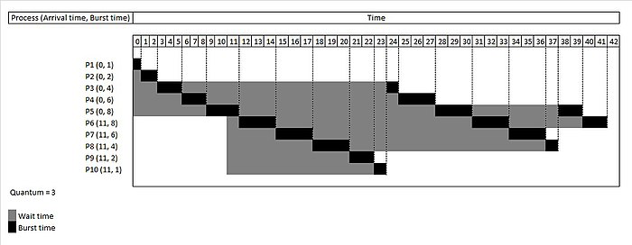
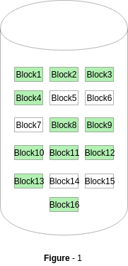

## 1. 总体设计

### 1.1 概述

此项目为 2023 年春季北京邮电大学操作系统课程设计项目，题目为《操作系统模拟程序的设计与实现》，课程设计的目的在于：加深理解操作系统的基本功能、原理和工作机制，理解并掌握操作系统的实现方法和技术，培养学生理解问题、分析问题、解决问题的能力，培养学生团队合作精神、组织协调能力，进一步培养提高学生的编程实践能力。

#### 1.1.1 功能描述

此项目设计并实现一个具有操作系统基本功能的软件，要求该软件具有操作系统的如下基本功能：

- 进程管理功能，如进程创建(new)、进程调度(scheduling)、进程阻塞(block)、进程唤醒(wakeup)、进程同步(synchronize)等。
- 内存管理功能，进程存储空间的分配和回收等。
- 文件系统，目录/文件的创建和删除、空间分配和回收。
- 设备管理，设备的申请、分配、使用、释放等。
- 程序运行的交互 UI 界面。
- 程序需要模拟实现操作系统的中断机制。

#### 1.1.2 运行环境

程序的运行环境为  *Windows Subsystem for Linux* (*WSL*) ，即 Windows 系统环境下安装的 Linux 虚拟机，所使用的 Linux 发型版为 [Debian 11 (bullseye)](https://www.debian.org/News/2021/20210814), 程序运行的宿主机内核版本为 Linux 5.10.16.3-microsoft-standard-WSL2  x86_64 GNU/Linux。

#### 1.1.3 开发环境

项目使用 VScode 代码编辑器配合 C/C++ 语言相关插件进行开发，团队使用 [Git](https://git-scm.com) 作为代码版本管理工具，代码托管在 [Github](https://github.com) 上的私有远程仓库进行协同开发，所有的代码遵循标准 GNU/Linux 系统 API, 编程语言上使用 C++17 标准进行开发。

### 1.2 设计思想

总体来说，程序使用面向对象的软件工程设计思想进行开发，我们将程序模块化设计，划分为如下几个模块：

1. 系统内存管理模块
2. 系统进程管理模块
3. 系统中断机制模块
4. 文件系统模块
5. 程序交互 UI 界面模块
6. 系统时钟管理 (timer) 模块
7. 系统设备管理模块

#### 1.2.1 软件设计构思

将程序设计划分为上述的几个模块，各个模块之间互相依赖写协作，共同实现操作系统的各个功能。举例来讲，操作系统的内存管理和进程管理为最基础以及最重要的模块，所有的其他模块和功能都要依赖内存管理，以及进程管理功能。与此同时系统的中断机制伴随程序的始终，现代操作系统使用中断驱动，我们将时钟管理模块(timer) 与此结合一起实现。

在交互 UI 界面上，程序在终端模拟一个操作系统 Shell，以及我们自己实现基本的交互指令。举例来说比如 Linux 默认的 `ls` shell 指令作用为列出当前目录下的文件功能。通过这种 Shell 指令与操作系统全程交互，实现用户对操作系统的使用和控制。

对于文件系统模块，设计模拟实现基本的操作系统文件增删读写功能，由于是“模拟”操作系统的功能，所以我们直接使用 Linux 系统提供给用户的底层 API，使用 C/C++ 语言自己更高级的语言特性来调用实现。

现代操作系统同时需要具有设备管理功能，在 Linux 系统下，一切设备都对应一个文件描述符，程序运行开始时刻监听设备的数量，插入已经拔出系统的各种设备等。

#### 1.2.2 关键技术与算法

需要考虑使用何种算法来实现的模块有内存管理模块、进程管理模块、文件系统模块。对于内存管理而言，现代操作系统常见的内存管理算法有三种：连续分区、页式和按需调页。在实现难度上，后两种都要考虑与虚拟内存的交互，但是在我们的“模拟”程序中，实现虚拟内存是内存较大的，所以目前暂定使用连续分页的机制来实现。在后续的团队协作开发进度来看，如果有更充裕的时间我们将考虑更换内存管理算法，比如使用最复杂的按需调页机制。

进程管理部分也有需要选择实现的算法，现代操作系统常见的进程调度算法比如先来先服务FCFS，时间片轮转算法(Round Robin) 算法，多级队列调度算法等。我们暂定使用时间片轮转算法来进程系统进程调度。

文件系统实现部分，使用树形结构等数据结构来维护实现，比如维护文件描述符，我们可以考虑使用哈希表来存储等操作。

#### 1.2.3 基本数据结构

在各种模块算法实现过程中，必然需要借助相对应的数据结构来辅助完成。在进程管理中，我们需要维护一个进程的队列，以时间片轮转算法来说，当一个进程的时间片用完后就回到队尾，队头的进程出队列进行运行，如下图所示 (图源 Wikipedia)：

在文件系统或者磁盘管理部分，数据结构也是重度依赖使用的。文件系统主要依赖 FCB 的功能实现，使用多叉树来维护文件结构。磁盘管理功能来说，常见的位示图(bitmap) ，或者使用链表来维护空闲以及被占用的磁盘块，如下图所示为使用 16 bit 序列 `0000111000000110` bitmap 维护的空闲磁盘空间：

### 1.3 基本处理流程

对于模拟一个现代的 Linux 操作系统，我们忽略掉硬件启动的部分，对于软件层面包括的处理流程主要为：

1. 内核启动：内核在启动时，首先会进行初始化，包括初始化内存管理、进程管理、文件系统等模块。然后，内核会启动系统的第一个进程 —— systemd，systemd 会负责启动其它服务和进程。对于我们自己模拟的程序，需要自己实现一个初始化程序来初始化所有系统服务。

2. 服务启动：系统初始化进程会启动各种服务，例如网络服务、文件系统服务、用户服务、日志服务等。
3. 进程管理： 系统使用进程来管理程序和服务，内核负责管理进程，包括创建、撤销、调度、通信和同步等操作。
4. 文件管理：操作系统通过文件系统管理文件和目录，支持各种文件系统类型和访问权限设置，包括文件的创建、读取、写入、删除、复制等操作。
5. 设备管理：操作系统会实时监听所有系统识别到的设备，同时映射为系统中的文件描述符。

我们的模拟程序会同时维护上述 5 个流程，以模拟实现现代操作系统的基本功能。

## 2. 软件的体系结构和模块设计

### 2.1 软件的体系结构

#### 2.1.1 软件体系结构框图

#### 2.1.2 软件主要模块及其依赖关系说明

### 2.2 软件数据结构设计

#### 2.2.1 全局数据结构说明

#### 2.2.2 数据结构与系统单元的关系

### 2.3 软件接口设计

#### 2.3.1 外部接口

#### 2.3.2 内部接口

## 3. 用户界面设计

### 3.1 界面的关系图

### 3.2 界面说明

#### 3.2.1 界面1

#### 3.2.2 界面2

#### 3.2.3 界面3

##  4. 相关处理流程

### 4.1 进程管理设计说明

#### 4.1.1 进程管理数据结构说明

* 进程控制块（Process Control Block, PCB）：结构体，用于记录每个进程的状态信息和控制信息。可能包括如下字段：
  - 进程标识符（PID）：整型，用于唯一标识一个进程。
  - 进程状态：枚举类型，表示进程的状态，如就绪、运行、阻塞等。
  - 进程优先级：整型，表示进程的优先级，用于进行进程调度。
  - 进程上下文信息：结构体，用于记录进程的上下文信息，如寄存器值、程序计数器等。
  - 进程资源使用情况：结构体或其他数据结构，用于记录进程使用的资源情况，如内存占用、文件描述符等。
* 进程队列（Process Queue）：数据结构，记录系统中正在就绪、运行和阻塞状态的进程队列。可能包括如下字段：
  - 就绪队列：队列，记录所有就绪状态的进程。
  - 运行队列：队列，记录当前正在运行的进程。
  - 阻塞队列：队列，记录因等待资源而被阻塞的进程。

#### 4.1.2 进程管理算法及流程说明

1. 进程调度算法：根据不同的调度策略和优先级，设计合适的进程调度算法。可能包括如下算法：
   - 先来先服务（FCFS）：按照进程到达的先后顺序进行调度。
   - 最短作业优先（SJF）：选择估计运行时间最短的进程进行调度。
   - 轮转法（Round Robin）：按照时间片轮流分配CPU时间，实现进程的轮转调度。
   - 优先级调度：根据进程的优先级进行调度，优先级高的进程先获得CPU使用权。 等等。
2. 进程状态转换流程：包括进程的创建、就绪、运行、阻塞和终止等状态之间的转换流程。可能包括如下流程：
   - 进程创建：根据用户请求或系统需要创建新进程，分配进程控制块（PCB），初始化PCB的各个字段。
   - 进程就绪：当一个进程的所有资源就绪，可以开始执行时，将其放入就绪队列中。
   - 进程调度：根据选定的调度算法，从就绪队列中选择一个进程进行调度，将其放入运行队列中，并执行该进程。
   - 进程阻塞：当一个进程由于等待某个资源而无法继续执行时，将其从运行队列中移出，并放入阻塞队列中。
   - 进程唤醒：当一个进程等待的资源变得可用时，将其从阻塞队列中唤醒，并放入就绪队列中，等待调度。

#### 4.1.3 数据存储说明

- 进程信息存储：将进程的相关信息存储在PCB中，包括进程状态、程序计数器、寄存器信息、内存分配信息、打开文件列表等。
- 进程控制数据存储：将进程控制数据存储在操作系统的内存中，以便在进程调度和状态管理时进行快速访问和修改。

### 4.2 内存管理设计说明

#### 4.2.1 内存管理数据结构说明

- 内存管理单元（Memory Management Unit, MMU）：结构体或其他数据结构，用于管理系统的物理内存。可能包括如下字段：
  - 内存分页表：用于记录进程的虚拟地址与物理地址之间的映射关系。
  - 空闲内存列表：用于记录系统中空闲的物理内存块。
  - 分页/分段算法相关字段：根据具体的存储管理算法而定，可能包括用于分页或分段算法的数据结构。
- 页面表（Page Table）：数据结构，用于记录进程的虚拟地址与物理地址之间的映射关系。可能包括如下字段：
  - 虚拟页号（Virtual Page Number, VPN）：用于标识进程的虚拟页号。
  - 物理页号（Physical Page Number, PPN）：用于记录虚拟页号对应的物理页号。
  - 页面状态位：用于记录页面的状态，如是否被分配、是否被修改等。

#### 4.2.2 内存管理算法及流程说明

- 分页算法：包括将进程的虚拟地址划分为固定大小的页，并将页映射到物理内存中的页面的算法。可能包括如下算法：
  - 固定大小分页（Fixed-size Paging）：将进程的虚拟地址划分为固定大小的页，直接进行页映射。
  - 变长分页（Variable-size Paging）：将进程的虚拟地址按需划分为不同大小的页，需要时再进行页映射。
- 分段算法：包括将进程的虚拟地址划分为不同大小的段，并将段映射到物理内存中的页面的算法。可能包括如下算法：
  - 固定大小分段（Fixed-size Segmentation）：将进程的虚拟地址划分为固定大小的段，直接进行段映射。
  - 变长分段（Variable-size Segmentation）：将进程的虚拟地址按需划分为不同大小的段，需要时再进行段映射。

#### 4.2.3 数据存储说明

在内存管理中，需要对内存块的信息进行存储，常用的存储方式有：

- 内存块链表：将内存块组织成链表形式，每个节点存储一个内存块的信息，包括其起始地址和大小信息以及状态（已分配或空闲）等。

### 4.3 中断处理设计说明

#### 4.3.1 中断处理数据结构说明

- 中断控制块（Interrupt Control Block）
  - interruptType; // 中断类型
  - interruptPriority; // 中断优先级

- 中断队列（Interrupt Queue）
  - InterruptControlBlock icb; // 中断控制块
  - InterruptQueue* next; // 指向下一个中断队列的指针

#### 4.3.2 中断处理算法及流程说明

- 中断触发：当外部设备或系统内部产生中断信号时，中断处理模块需要根据中断源和优先级等信息判断中断是否需要处理，并将中断请求记录到中断控制块（ICB）中。
- 中断处理函数调用：根据中断控制块中记录的中断处理函数入口地址，调用相应的中断处理函数。中断处理函数是预先定义的处理中断的函数，可以执行中断处理逻辑，如保存现场、处理中断请求、更新系统状态等。
- 中断处理顺序管理：中断处理模块需要管理多个中断的处理顺序，通常采用优先级管理策略，根据中断控制块中记录的中断优先级信息，确定下一个要处理的中断。一般情况下，具有更高优先级的中断会优先处理，而具有较低优先级的中断则可能被延迟处理。
- 中断处理完成：当中断处理函数执行完毕后，中断处理模块需要根据实际情况更新中断控制块中的状态，如清除中断标志、更新中断优先级等，并将中断控制块从中断队列中移除，以便下一次中断触发时能够正确处理。

#### 4.3.3 数据存储说明

* 中断处理数据存储：将中断向量表和中断控制信息存储在操作系统的内存中，以便在中断处理时进行快速访问和修改。

### 4.4 文件系统设计说明

#### 4.4.1 文件系统数据结构说明

- 类名：shell
- 成员变量：
  - order: 存储传递给shell解析器的命令行参数
  - private:
    - split()：一个私有函数，用于将字符串按照空格进行分割
- 成员函数：
  - shell()：构造函数，初始化shell对象
  - shell(string order)：带参数的构造函数，用于接收命令行参数
  - bool analyse()：用于解析传递给shell对象的命令行参数，并调用相应的函数执行相应的命令。
  - bool runFileOrder(const vector<string>& fileorder)：执行文件系统命令。
  - void setOrder(string order)：用于设置命令行参数。

#### 4.4.2 文件系统算法及流程说明

- 构造函数：在初始化时，创建一个根节点（FileNode），类型为目录（type=0），并将其设为当前节点（current）。
- 文件系统的各种操作：接下来需要实现文件系统的各种操作，例如展示当前目录下的文件和子目录、转到指定目录、创建目录、创建文件、删除文件或目录、打开指定文件等。这些操作可以通过对文件系统树上的节点进行增删查改来实现。
- 实现文件的读写：文件读写是文件系统的核心功能，需要通过文件控制块来实现。读取文件时需要指定读取的数据量和读取到的缓冲区，写文件时需要指定写入的数据量和写入的缓冲区。同时，需要保证多个进程之间对同一文件的读写是互斥的。

#### 4.4.3 数据存储说明

### 4.5 设备处理

#### 4.5.1 设备处理数据结构说明

在设备处理中，我们需要定义以下数据结构：

- 进程控制块（Process Control Block，PCB）：用于管理进程

- 设备控制块（Device Control Block，DCB）：用于描述设备的相关信息，如设备的名称、类型、状态等。

  - DCB：设备控制表
    - size：设备数量
    - waitingHead：等待中的第一个进程
    - waitingEnd：等待中的最后一个进程

  - DCBItem：DCB表项

    - deviceID：设备ID
    - busy：设备是否在工作中

  - waiting：设备请求队列

    - size：等待队列大小

    - PCBptr：需要使用设备的进程

初步确定有如下函数：

- `init_device()` 设备状态初始化
- `get_index_by_deviceID(unsigned char deviceID)` 获取设备对应在设备控制表中的位置即下标 `index` 
- `registe_device(unsigned char deviceID)` 添加设备
- `apply_device(int pid, unsigned char deviceID)` 设备开始应用
- `release_device(int pid, unsigned char deviceID)` 设备应用完后释放

#### 4.5.2 设备处理算法及流程说明

设备处理的算法和流程如下：

- 设备驱动程序：负责与硬件设备进行通信，处理设备相关的中断和异常，向设备请求队列中添加或移除设备请求。
- 设备请求队列管理：管理设备请求队列，处理进程请求设备的优先级、顺序、并发等问题
  - 具体算法为先到先服务

- 设备控制块管理：管理设备控制块，维护设备状态信息，如设备是否空闲、是否可用等。

#### 4.5.3 数据存储说明

在设备处理中，一般不需要进行数据存储。设备控制块和 I/O 请求块的数据可以直接保存在内存中，而不需要保存在磁盘上。

## 5. 总结

本概要设计报告包括了进程管理、内存管理、中断处理、文件系统和设备处理等方面的设计，为后续详细设计和实现提供了指导和参考。通过合理的数据结构和算法设计，实现了系统资源的高效管理和调度，提高了操作系统的性能和稳定性。同时，考虑了数据存储和数据处理的要求，确保了系统的数据管理和访问的安全性和一致性。本设计报告为后续的开发工作奠定了基础，并为实现一个功能强大、高性能、稳定可靠的操作系统提供了框架和指导。

## 参考文献：
