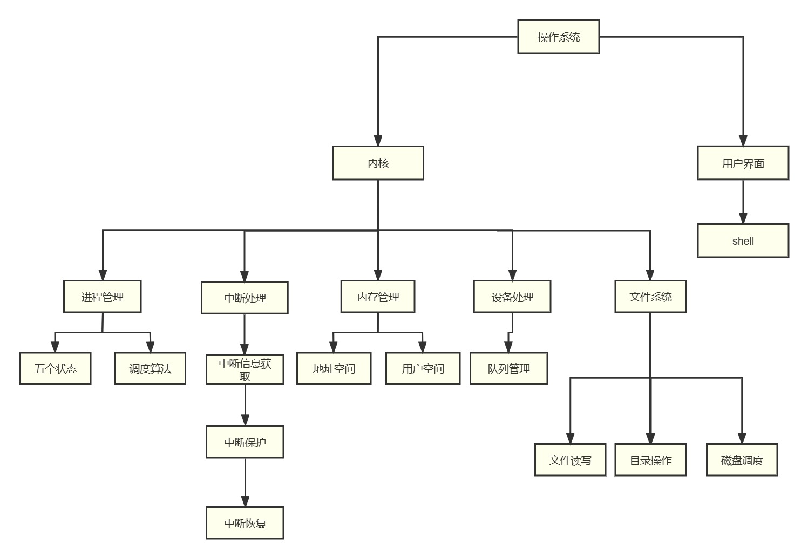
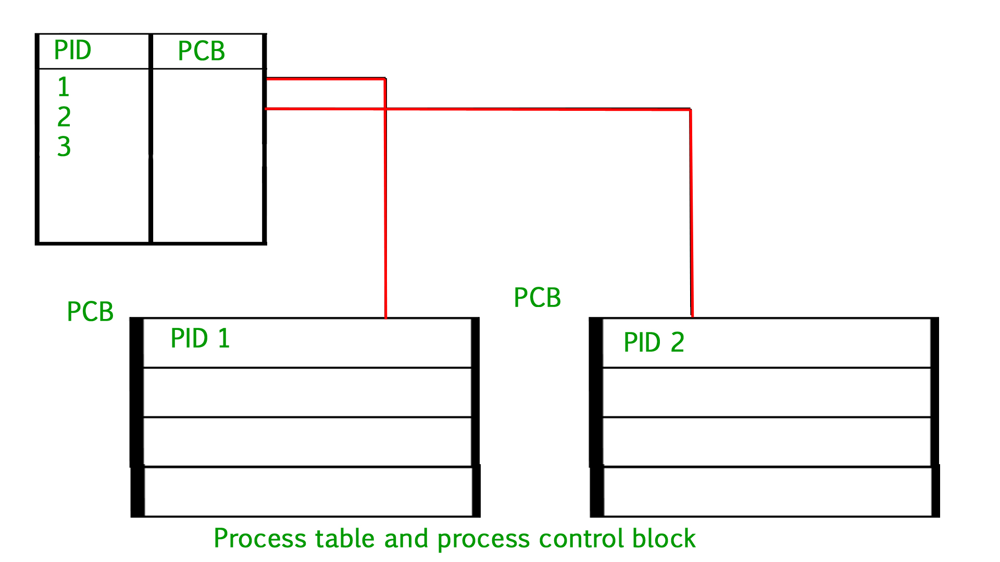
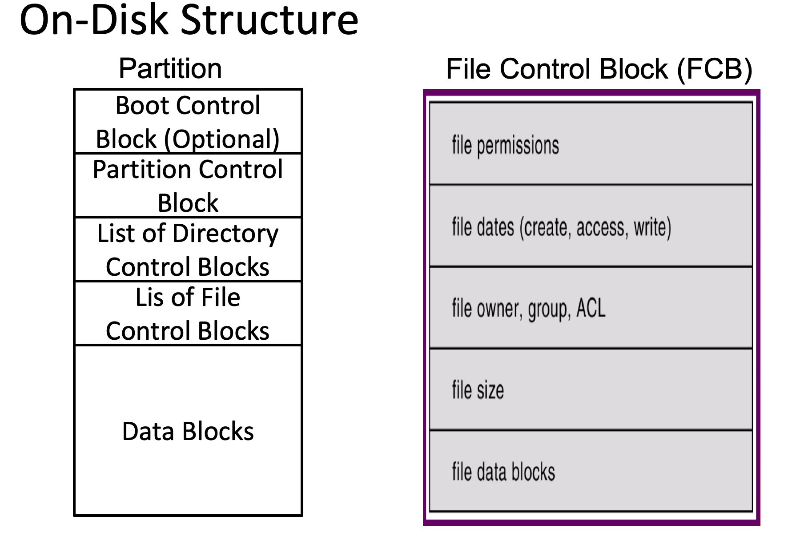
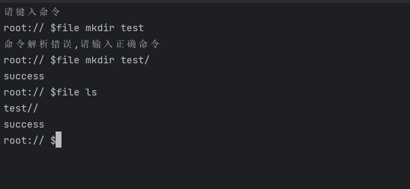

# 操作系统课程设计-概要设计

[toc] 

## 1. 总体设计

### 1.1 概述

此项目为 2023 年春季北京邮电大学操作系统课程设计项目，题目为《操作系统模拟程序的设计与实现》，课程设计的目的在于：加深理解操作系统的基本功能、原理和工作机制，理解并掌握操作系统的实现方法和技术，培养学生理解问题、分析问题、解决问题的能力，培养学生团队合作精神、组织协调能力，进一步培养提高学生的编程实践能力。

#### 1.1.1 功能描述

此项目设计并实现一个具有操作系统基本功能的软件，要求该软件具有操作系统的如下基本功能：

- 进程管理功能，如进程创建(new)、进程调度(scheduling)、进程阻塞(block)、进程唤醒(wakeup)、进程同步(synchronize)等。
- 内存管理功能，进程存储空间的分配和回收等。
- 文件系统，目录/文件的创建和删除、空间分配和回收。
- 设备管理，设备的申请、分配、使用、释放等。
- 程序运行的交互 UI 界面。
- 程序需要模拟实现操作系统的中断机制。

#### 1.1.2 运行环境

程序的运行环境为  *Windows Subsystem for Linux* (*WSL*)[^1] ，即 Windows 系统环境下安装的 Linux 虚拟机，所使用的 Linux 发型版为 [Debian 11 (bullseye)](https://www.debian.org/News/2021/20210814), 程序运行的宿主机内核版本为 Linux 5.10.16.3-microsoft-standard-WSL2  x86_64 GNU/Linux。

#### 1.1.3 开发环境

项目使用 VScode 代码编辑器配合 C/C++ 语言相关插件进行开发，团队使用 [Git](https://git-scm.com) 作为代码版本管理工具，代码托管在 [Github](https://github.com) 上的私有远程仓库进行协同开发，所有的代码遵循标准 GNU/Linux 系统 API[^2], 编程语言上使用 C++17 标准进行开发。

### 1.2 设计思想

总体来说，程序使用面向对象的软件工程设计思想进行开发，我们将程序模块化设计，划分为如下几个模块：

1. 系统内存管理模块
2. 系统进程管理模块
3. 系统中断机制模块
4. 文件系统模块
5. 程序交互 UI 界面模块
6. 系统时钟管理 (timer) 模块
7. 系统设备管理模块

#### 1.2.1 软件设计构思

将程序设计划分为上述的几个模块，各个模块之间互相依赖写协作，共同实现操作系统的各个功能。举例来讲，操作系统的内存管理和进程管理为最基础以及最重要的模块，所有的其他模块和功能都要依赖内存管理，以及进程管理功能。与此同时系统的中断机制伴随程序的始终，现代操作系统使用中断驱动，我们将时钟管理模块(timer) 与此结合一起实现。

在交互 UI 界面上，程序在终端模拟一个操作系统 Shell，以及我们自己实现基本的交互指令。举例来说比如 Linux 默认的 `ls` shell 指令作用为列出当前目录下的文件功能。通过这种 Shell 指令与操作系统全程交互，实现用户对操作系统的使用和控制。

对于文件系统模块，设计模拟实现基本的操作系统文件增删读写功能，由于是“模拟”操作系统的功能，所以我们直接使用 Linux 系统提供给用户的底层 API，使用 C/C++ 语言自己更高级的语言特性来调用实现。

现代操作系统同时需要具有设备管理功能，在 Linux 系统下，一切设备都对应一个文件描述符，程序运行开始时刻监听设备的数量，插入已经拔出系统的各种设备等。

#### 1.2.2 关键技术与算法

需要考虑使用何种算法来实现的模块有内存管理模块、进程管理模块、文件系统模块。对于内存管理而言，现代操作系统常见的内存管理算法有三种：连续分区、页式和按需调页。在实现难度上，后两种都要考虑与虚拟内存的交互，但是在我们的“模拟”程序中，实现虚拟内存是内存较大的，所以目前暂定使用连续分页的机制来实现。在后续的团队协作开发进度来看，如果有更充裕的时间我们将考虑更换内存管理算法，比如使用最复杂的按需调页机制。

进程管理部分也有需要选择实现的算法，现代操作系统常见的进程调度算法比如先来先服务FCFS，时间片轮转算法(Round Robin)[^3] 算法，多级队列调度算法等。我们暂定使用时间片轮转算法来进程系统进程调度。

文件系统实现部分，使用树形结构等数据结构来维护实现，比如维护文件描述符，我们可以考虑使用哈希表来存储等操作。

#### 1.2.3 基本数据结构

在各种模块算法实现过程中，必然需要借助相对应的数据结构来辅助完成。在进程管理中，我们需要维护一个进程的队列，以时间片轮转算法来说，当一个进程的时间片用完后就回到队尾，队头的进程出队列进行运行，如下图所示 (图源 Wikipedia)：


在文件系统或者磁盘管理部分，数据结构也是重度依赖使用的。文件系统主要依赖 FCB[^4] 的功能实现，使用多叉树来维护文件结构。磁盘管理功能来说，常见的位示图(bitmap) ，或者使用链表来维护空闲以及被占用的磁盘块，如下图所示为使用 16 bit 序列 `0000111000000110` bitmap 维护的空闲磁盘空间：


### 1.3 基本处理流程

对于模拟一个现代的 Linux 操作系统，我们忽略掉硬件启动的部分，对于软件层面包括的处理流程主要为：

1. 内核启动：内核在启动时，首先会进行初始化，包括初始化内存管理、进程管理、文件系统等模块。然后，内核会启动系统的第一个进程 —— systemd，systemd 会负责启动其它服务和进程。对于我们自己模拟的程序，需要自己实现一个初始化程序来初始化所有系统服务。

2. 服务启动：系统初始化进程会启动各种服务，例如网络服务、文件系统服务、用户服务、日志服务等。
3. 进程管理： 系统使用进程来管理程序和服务，内核负责管理进程，包括创建、撤销、调度、通信和同步等操作。
4. 文件管理：操作系统通过文件系统管理文件和目录，支持各种文件系统类型和访问权限设置，包括文件的创建、读取、写入、删除、复制等操作。
5. 设备管理：操作系统会实时监听所有系统识别到的设备，同时映射为系统中的文件描述符。

我们的模拟程序会同时维护上述 5 个流程，以模拟实现现代操作系统的基本功能。


## 2. 软件的体系结构和模块设计

### 2.1 软件的体系结构

#### 2.1.1 软件体系结构框图



#### 2.1.2 软件主要模块及其依赖关系说明

- 用户界面：采用一个类似于Linux的Shell页面

- 内核：采用大内核模式，将如下五大功能都放在内核中运行，减少变态次数，提高效率 

  - 进程管理：包括进程的五种状态以及进程调度算法，如时间片轮询等
  - 中断处理：当中断发生后，需要将当前进程中断，等事情发生后再运行
  - 内存管理：包括地址空间和用户空间
  - 设备处理：对输入输出设备队列管理
  - 文件系统：有文件读写，磁盘调度等管理

  以上五大功能基于计算机系统本身的原语执行

  

### 2.2 软件数据结构设计

#### 2.2.1 全局数据结构说明

首先是进程管理模块中，需要实现 [Process Table and Process Control Block (PCB)](https://www.geeksforgeeks.org/process-table-and-process-control-block-pcb/) 的全局数据结构，常见的 PCB[^5] 设计有如下几个部分：

```c++
typedef struct ProgramControlBlock
{

    int pid;            // pid
    int slice_cnt;      // 使用过的时间片数量
    int time_need;      // 预计还需要的时间
    int size;           // 大小
    int pagetable_addr; // 页表首地址
    int pagetable_pos;  // 当前载入内存中使用的页表序号
    int pagetable_len;  // 页表长度
    int state;          // 进程状态
    int priority;       // 优先级
    std::string name;   // 进程名称
    struct ProgramControlBlock *parent; // 父进程
    /*这里应该补充打开文件，用一个结构ofile来保存所有在这个进程打开的文件*/
} PCB;
```


* pid，进程号
* slice_cnt，使用的时间片数量
* time_need，需要的时间
* size，进程大小
* pagetable_addr，页表首地址
* pagetable_pos，当前载入内存中使用的页表序号
* pagetabel_len，页表长度
* state，进程状态
* priority，优先级
* *parent，父进程指针

- Open File Lists, 打开文件列表 - 此信息包括为进程打开的文件列表。

其中 PCB 与 PID 的依赖控制关系如下图所示：



还有一个全局数据结构为 File Control Block(FCB), 文件控制块是维护打开文件状态的文件系统结构。FCB 由操作系统管理，但它驻留在使用该文件的程序的内存中，而不是操作系统内存中。这使得进程可以同时打开尽可能多的文件，只要它可以为每个文件分配足够的内存来存储一个 FCB, 一个 FCB 的组成部分如下示意图：



#### 2.2.2 数据结构与系统单元的关系

系统单元被我们模块化，每个模块的数据结构负责其所有的功能实现。比如 FCB 控制文件系统模块的所有功能，在 2.3 节的软件接口设计中，会使用代码说明如何设计这些接口。

### 2.3 软件接口设计

#### 2.3.1 外部接口

首先操作系统和人需要通过 shell 交互，外部接口实现一个与我们进行指令交互的 shell，比如输入 `ls` 指令列出当前目录下的文件，设计原则基本遵循 GNU/Linux 的标准，接口实现如下：

```cpp
class shell {
//shell解析器
public:
    shell()= default;
    //接受命令行参数
    shell(string order):order(std::move(order)){};

    //分析命令
    bool  analyse();

    //执行文件系统命令
    bool runFileOrder(const vector<string>&fileorder);

    //执行其他命令
    void setOrder(string order) {
        this->order=std::move(order);
    }
private:
    string order;
private:
    vector<string>split();//按字符串分割
};
```

#### 2.3.2 内部接口

内部接口包括进程管理的 PCB 接口，文件管理模块的 FCB 接口，中断实现的接口，设备管理接口等等。

PCB 的基本实现为如下所示：

```cpp
class Process {
public:
    //进程需要用的变量以及函数
    PCB pcb;                  // PCB表

    void createProcess();     // 创建线程对象
    int get_pid() const { return pcb.pid; }
    int get_priority() const { return pcb.priority; }
    int get_status() const { return pcb.state; }
    void set_PCB(int pid, PRIORITY pri, PSTATE sta) {pcb.pid = pid, pcb.priority = pri, pcb.state = sta;}
    void set_priority(int pri) { pcb.priority = pri; }
    void set_status(PSTATE sta) { pcb.state = sta; }
    void suspend() { pcb.state = SUSPEND; }
    void resume() { pcb.state = READY; }
    void terminate() { pcb.state = TERMINATED; }


    //...
};
struct {
    /*一个进程的同步变量*/
    vector<Process> ReadyQueue;     // 准备队列
    vector<Process> WaitQueue;      // 等待队列
} procQueue;
```

同样，对于文件管理模块，FCB 的基本实现如下：

```cpp
class FCB {
private:
    string file_name;   // 文件名
    int file_size;      // 文件大小
    int file_mode;      // 文件打开模式
    bool is_opened;     // 是否已打开
    // 其他属性

public:
    FCB(string name, int size, int mode) : file_name(name), file_size(size), file_mode(mode), is_opened(false) {}

    string get_file_name() const { return file_name; }
    int get_file_size() const { return file_size; }
    int get_file_mode() const { return file_mode; }
    bool get_is_opened() const { return is_opened; }
    // 其他获取属性的方法

    void set_file_size(int size) { file_size = size; }
    void set_file_mode(int mode) { file_mode = mode; }
    void set_is_opened(bool opened) { is_opened = opened; }
    // 其他设置属性的方法

    void open() { is_opened = true; }
    void close() { is_opened = false; }
    // 其他操作方法
};
```

中断管理部分的接口如下：

```c++
/// 初始化中断
void init_interupt();

/// 关中断 
void push_off();

/// 开中断
void pop_off();

/// 安装一个中断处理程序
void set_handler(InteruptType type, InteruptFunc f);

/// 产生一个中断；供外部设备使用
void raise_interupt(InteruptType t, int device_id, int64_t value);

/// 处理中断; 由执行指令的部分调用
/// 为防止中断过多，这里会处理全部可处理的中断
void handle_interupt();

```


## 3. 用户界面设计

我们的界面将采取类似Linux操作系统的shell界面,并且设计了一系列针对shell界面的命令，当不进行操作时，显示系统当前的文件夹并随时准备接受命令，当接受命令后转入处理命令的界面，当处理并执行完界面后，继续回到当前shell命令

### 3.1 界面说明



shell操作如图所示，图示中为打开shell后输入$file mkdir test/ ，在当前目录下创建一个名为“test”的子目录。


##  4. 相关处理流程

### 4.1 进程管理设计说明

#### 4.1.1 进程管理数据结构说明

* 进程控制块（Process Control Block, PCB）：结构体，用于记录每个进程的状态信息和控制信息。可能包括如下字段：
  - 进程标识符（PID）：整型，用于唯一标识一个进程。
  - 进程状态：枚举类型，表示进程的状态，如就绪、运行、阻塞等。
  - 进程优先级：整型，表示进程的优先级，用于进行进程调度。
  - 进程上下文信息：结构体，用于记录进程的上下文信息，如寄存器值、程序计数器等。
  - 进程资源使用情况：结构体或其他数据结构，用于记录进程使用的资源情况，如内存占用、文件描述符、时间片等。
* 进程队列（procQueue）：数据结构，记录系统中正在就绪、运行和阻塞状态的进程队列。可能包括如下字段：
  - 就绪队列：队列，记录所有就绪状态的进程。
  - 阻塞队列：队列，记录因等待资源而被阻塞的进程。

#### 4.1.2 进程管理算法及流程说明

1. 进程调度算法：根据不同的调度策略和优先级，设计合适的进程调度算法。可能包括如下算法：
   - 先来先服务（FCFS）：按照进程到达的先后顺序进行调度。
   - 最短作业优先（SJF）：选择估计运行时间最短的进程进行调度。
   - 轮转法（Round Robin）：按照时间片轮流分配CPU时间，实现进程的轮转调度。
   - 优先级调度：根据进程的优先级进行调度，优先级高的进程先获得CPU使用权。 等等。
2. 进程状态转换流程：包括进程的创建、就绪、运行、阻塞和终止等状态之间的转换流程。可能包括如下流程：
   - 进程创建：根据用户请求或系统需要创建新进程，分配进程控制块（PCB），初始化PCB的各个字段。
   - 进程就绪：当一个进程的所有资源就绪，可以开始执行时，将其放入就绪队列中。
   - 进程调度：根据选定的调度算法，从就绪队列中选择一个进程进行调度，将其放入运行队列中，并执行该进程。
   - 进程阻塞：当一个进程由于等待某个资源而无法继续执行时，将其从运行队列中移出，并放入阻塞队列中。
   - 进程唤醒：当一个进程等待的资源变得可用时，将其从阻塞队列中唤醒，并放入就绪队列中，等待调度。

#### 4.1.3 数据存储说明

- 进程信息存储：将进程的相关信息存储在PCB中，包括进程状态、程序计数器、寄存器信息、内存分配信息、打开文件列表等。
- 进程控制数据存储：将进程控制数据存储在操作系统的内存中，以便在进程调度和状态管理时进行快速访问和修改。

### 4.2 内存管理设计说明

#### 4.2.1 内存管理数据结构说明

- 页面表（Page Table）：数据结构，用于记录进程的虚拟地址与物理地址之间的映射关系。包括如下字段：

  - 虚拟地址数组：用于标识进程的虚拟页号。
  - 物理地址数组：用于记录虚拟页号对应的物理页号。与虚拟地址数组存在一一对应关系。
  - 页面状态位：用于记录页面的状态，记录页表是否被分配，被修改，是否只读。
  - 页表号，记录页表的顺序号码。
  - 页表指针，指向下一个页表。

  包含以下函数：

  - init():初始化页表
  - read(int page_num,bool IsUsed,v_address address,pagetable *page)：读入页表
  - write(int page_num,bool IsUsed,bool IsReadonly,bool IsDirty, pagetable *page);;写入页表
  - Findphyaddr(int page_num,bool IsUsed,v_address address,pagetable *page);根据虚拟地址找到物理地址
  - Free(int page_num,pagetable *page);释放页表

  ```cpp
  class pagetable{
  private:
      int page_num;//页号
      bool IsUsed;//该页是否被用
      bool IsReadonly;//该页是否只读
      bool IsDirty ; //该页是否被修改
      page_set virtual_page[PAGESIZE];//虚拟内存地址页，最大储量为pagetable；
      page_set physical_page[PAGESIZE];//物理内存地址页
      pagetable *pagenext;
  public:
      void init();
      int read(int page_num,bool IsUsed,v_address address,pagetable *page);
      int write(int page_num,bool IsUsed,bool IsReadonly,bool IsDirty, pagetable *page);
      int Findphyaddr(int page_num,bool IsUsed,v_address address,pagetable *page);//设计寻址算法
      int Free(int page_num,pagetable *page);
  };
  
  ```

#### 4.2.2 内存管理算法及流程说明

- 分页算法：包括将进程的虚拟地址划分为固定大小的页，并将页映射到物理内存中的页面的算法。可能包括如下算法：
  - 固定大小分页（Fixed-size Paging）：将进程的虚拟地址划分为固定大小的页，直接进行页映射。
  - 变长分页（Variable-size Paging）：将进程的虚拟地址按需划分为不同大小的页，需要时再进行页映射。
- 分段算法：包括将进程的虚拟地址划分为不同大小的段，并将段映射到物理内存中的页面的算法。可能包括如下算法：
  - 固定大小分段（Fixed-size Segmentation）：将进程的虚拟地址划分为固定大小的段，直接进行段映射。
  - 变长分段（Variable-size Segmentation）：将进程的虚拟地址按需划分为不同大小的段，需要时再进行段映射。

#### 4.2.3 数据存储说明

在内存管理中，需要对内存块的信息进行存储，存储方式有：

- 内存块链表：将内存块组织成链表形式，每个节点存储一个内存块的信息，包括其起始地址和大小信息以及状态（已分配或空闲）等。

### 4.3 中断处理设计说明

#### 4.3.1 中断处理数据结构说明

- 中断向量表：包括不同中断类型的各种中断信息和指向中断服务程序的指针。

- 中断类型分为：

  - 外部中断
  - 系统调用
  - 异常
  - 时钟中断

- 中断向量表和里面的各种表项，表项包括：

  - `unsigned char id` ID
  - `device_id`设备ID
  - `IVTable_TYPE type`中断类型
  - `unsigned char info[MAX_IVT_INFO_LEN]`中断信息
  - `unsigned char* function`跳转到相应中断服务程序指针

- mask：用户可以选择屏蔽某些中断信号。

  本质是一个int，通过修改上面的bit实现屏蔽和不屏蔽

  异常无法被屏蔽，异常必须被处理


#### 4.3.2 中断处理算法及流程说明

进程执行每条指令的时候，都会调用检查当前中断。如果存在中断，那么进程会执行。

处理中断时首先关闭中断，保存上下文环境再检查中断信号的产生原因，查表，并跳转到对应中断服务程序。执行结束，开中断，还原上下文环境

在这里说明一下一些基本的函数说明

1. Void push_off() 关中断

运行过程：设置中断mask为全部屏蔽，同时保存CPU的中断mask

运行结果：屏蔽除异常外的中断

2. Void pop_off() 开中断

运行过程：还原CPU的中断mask

运行结果：取消屏蔽

3. Void init_interupt() 初始化

运行过程：初始化中断向量表，安装默认处理函数；初始化CPU中断mask；启动定时器中断线程；启动中断监听线程。

4. Void install_handler(INT_T,void*); 

运行过程: 在中断向量表中保存对应中断的中断服务程序

5. void raise_interupt(INT_T,size_t device_id,int64_t value)

参数：中断类型，设备id，数值(或者指针）

运行过程：生成一个中断信号，将其数据压入优先队列中

6. Void handle_interupt()

运行过程: 由进程调用；取出一个中断信号，并调用响应的服务程序进程处理

#### 4.3.3 数据存储说明

* 中断处理数据存储：中断向量表放在内存空间中，各种中断信息和指向中断服务程序的指针放到中断向量表中。

### 4.4 文件系统设计说明

#### 4.4.1 文件系统数据结构说明

- 类名：shell
- 成员变量：
  - order: 存储传递给shell解析器的命令行参数
  - private:
    - split()：一个私有函数，用于将字符串按照空格进行分割
- 成员函数：
  - shell()：构造函数，初始化shell对象
  - shell(string order)：带参数的构造函数，用于接收命令行参数
  - bool analyse()：用于解析传递给shell对象的命令行参数，并调用相应的函数执行相应的命令。
  - bool runFileOrder(const vector<string>& fileorder)：执行文件系统命令。
  - void setOrder(string order)：用于设置命令行参数。

#### 4.4.2 文件系统算法及流程说明

- 构造函数：在初始化时，创建一个根节点（FileNode），类型为目录（type=0），并将其设为当前节点（current）。
- 文件系统的各种操作：接下来需要实现文件系统的各种操作，例如展示当前目录下的文件和子目录、转到指定目录、创建目录、创建文件、删除文件或目录、打开指定文件等。这些操作可以通过对文件系统树上的节点进行增删查改来实现。
- 实现文件的读写：文件读写是文件系统的核心功能，需要通过文件控制块来实现。读取文件时需要指定读取的数据量和读取到的缓冲区，写文件时需要指定写入的数据量和写入的缓冲区。同时，需要保证多个进程之间对同一文件的读写是互斥的。

#### 4.4.3 数据存储说明

### 4.5 设备处理

#### 4.5.1 设备处理数据结构说明

在设备处理中，我们需要定义以下数据结构：

- 进程控制块（Process Control Block，PCB）：用于管理进程（该结构在进程模块定义）
- 设备控制块（Device Control Block，DCB）：用于描述设备的相关信息，如设备的名称、类型、状态等。

  - DCT：设备控制表
    - size：设备数量
    - DCTitem[DCT_lenth]：DCB表项
  - DCTItem：DCT表项

    - deviceID：设备ID
    - busy：设备是否在工作中
    - usingPro：正在占用该设备的进程（可空）
    - waitingPro：该设备请求队列
  - waitingPro：设备请求队列

    - size：等待队列大小

    - waitingHead：等待中的第一个进程

    - waitingEnd：等待中的最后一个进程
    - PCBptrQueue：需要使用设备的进程

初步确定有如下函数：

- `init_device()` 设备状态初始化
- `registe_device(int deviceID)` 添加设备
- `apply_device(int pid, int deviceID)` 设备开始应用
- `release_device(int pid, int deviceID)` 设备应用完后释放
- `find_using_pro(int deviceID)` 查找正在调用该设备的进程
- `find_use_prolist(int deviceID)` 查找等待该设备中的进程队列
- `add_process(int pid, int deviceID)` 添加进程进入设备请求队列

#### 4.5.2 设备处理算法及流程说明

设备处理的算法和流程如下：

- 设备驱动程序：负责与硬件设备进行通信，处理设备相关的中断和异常，向设备请求队列中添加或移除设备请求。
- 设备请求队列管理：管理设备请求队列，处理进程请求设备的优先级、顺序、并发等问题
  - 具体算法为先到先服务

- 设备控制块管理：管理设备控制块，维护设备状态信息，如设备是否空闲、是否可用等。

#### 4.5.3 数据存储说明

在设备处理中，一般不需要进行数据存储。设备控制块的数据可以直接保存在内存中，而不需要保存在磁盘上。


## 5. 总结

操作系统是一种重要的系统软件，其功能是为应用程序提供基础的系统支持，例如管理进程、内存、文件和设备等。在操作系统的基本实现中，通常包含以下几个方面的内容：

1. 进程管理：进程是操作系统中最基本的执行单位，操作系统需要负责创建、销毁、调度和协调进程之间的通信和同步等功能。
2. 内存管理：内存是操作系统中非常重要的资源，操作系统需要负责管理内存的分配和回收，并保证各个进程之间不会互相干扰。
3. 文件管理：文件是操作系统中存储数据的主要方式，操作系统需要提供文件的创建、读写、删除等基本操作，并管理各个进程对文件的访问。
4. 设备管理：设备是操作系统中输入输出的主要方式，操作系统需要负责管理设备的访问，并提供设备驱动程序以便应用程序可以方便地访问设备。
4. 中断管理：中断操作是操作系统中最重要的操作之一，真实的操作系统需要通过中断切换用户态到内核态，进行一系列保存现场的操作之后进行恢复。

为了实现以上功能，操作系统需要依靠各种数据结构、算法和接口等，例如进程控制块（PCB）、文件控制块（FCB）、中断处理程序等。同时，操作系统还需要考虑到各种复杂的情况，例如死锁、资源竞争等，以保证操作系统的稳定和可靠性。

总之，操作系统是一种非常复杂和重要的系统软件，它为应用程序提供了基础的系统支持，使得应用程序可以方便地使用计算机系统的各种资源。

## 参考文献：

[^1]: [Windows Subsystem for Linux](https://en.wikipedia.org/wiki/Windows_Subsystem_for_Linux)
[^2]: [Linux Standards & POSIX](https://www.linux.org/threads/linux-standards.11759/)
[^3]: [Round-robin scheduling](https://en.wikipedia.org/wiki/Round-robin_scheduling)

[^4]: [File Control Block - Wikipedia](https://en.wikipedia.org/wiki/File_Control_Block)

[^5]: [Process Table and Process Control Block (PCB)](https://www.geeksforgeeks.org/process-table-and-process-control-block-pcb/)

