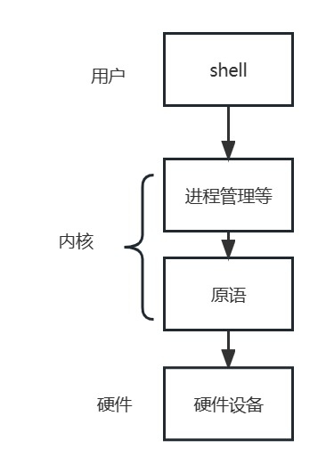

#  操作系统课程设计-详细设计

[TOC]

##  1.总体设计

###  1.1 概述

此项目为 2023 年春季北京邮电大学操作系统课程设计项目，题目为《操作系统模拟程序的设计与实现》，课程设计的目的在于：加深理解操作系统的基本功能、原理和工作机制，理解并掌握操作系统的实现方法和技术，培养学生理解问题、分析问题、解决问题的能力，培养学生团队合作精神、组织协调能力，进一步培养提高学生的编程实践能力。本篇报告为操作系统项目的详细设计，是基于概要设计的详细说明。

####  1.1.1功能描述

此项目设计并实现一个具有操作系统基本功能的软件，要求该软件具有操作系统的如下基本功能：

- 进程管理功能，如进程创建(new)、进程调度(scheduling)、进程阻塞(block)、进程唤醒(wakeup)、进程同步(synchronize)等。
- 内存管理功能，进程存储空间的分配和回收等。
- 文件系统，目录/文件的创建和删除、空间分配和回收。
- 设备管理，设备的申请、分配、使用、释放等。
- 程序运行的交互 UI 界面。
- 程序需要模拟实现操作系统的中断机制。

#### 1.1.2 运行环境

程序的运行环境为 *Windows Subsystem for Linux* (*WSL*)[1](https://github.com/Shlysz/os/blob/master/概要设计.md#user-content-fn-1-94808c6dbdbf2814149ed76a7def9d4a) ，即 Windows 系统环境下安装的 Linux 虚拟机，所使用的 Linux 发型版为 [Debian 11 (bullseye)](https://www.debian.org/News/2021/20210814), 程序运行的宿主机内核版本为 Linux 5.10.16.3-microsoft-standard-WSL2 x86_64 GNU/Linux。

#### 1.1.3 开发环境

项目使用 VScode 代码编辑器配合 C/C++ 语言相关插件进行开发，团队使用 [Git](https://git-scm.com/) 作为代码版本管理工具，代码托管在 [Github](https://github.com/) 上的私有远程仓库进行协同开发，所有的代码遵循标准 GNU/Linux 系统 API, 编程语言上使用 C++17 标准进行开发。

###  1.2 设计思想

####  1.2.1 软件设计构思

我们的程序使用面向对象的软件工程设计思想进行开发，我们将程序模块化设计，划分为如下几个模块：系统内存管理模块，系统进程管理模块，系统中断机制模块，文件系统模块，程序交互 UI 界面模块，系统时钟管理 (timer) 模块，系统设备管理模块。各模块相对独立，同时又互相依赖、配合，共同组成了一个模拟操作系统。

####  1.2.2 关键技术与算法

| 模块     | 相关算法                                   |
| -------- | ------------------------------------------ |
| 进程管理 | 时间片轮转的线程调度，进程间的同步          |
| 内存管理 | 通过虚拟地址来寻物理地址，内存的分配与回收 |
| 中断处理 |                                            |
| 文件系统 |                                            |
| 设备处理 |                                            |
| 界面     | 无                                         |


####  1.2.3 基本数据结构

| 模块     | 相关数据结构                                                 |
| -------- | ------------------------------------------------------------ |
| 进程管理 | 模拟CPU寄存器，PCB表，各进程状态队列                |
| 内存管理 | pagetable页表,TLB转换后备缓冲区，v_address虚拟地址,p_address物理地址 |
| 中断处理 |                                                              |
| 文件系统 |                                                              |
| 设备处理 |                                                              |
| 界面     |                                                              |


###  1.3 基本处理流程

对于模拟一个现代的 Linux 操作系统，我们忽略掉硬件启动的部分，对于软件层面包括的处理流程主要为：

-  内核启动：内核在启动时，首先会进行初始化，包括初始化内存管理、进程管理、文件系统等模块。然后，内核会启动系统的第一个进程 —— systemd，systemd 会负责启动其它服务和进程。对于我们自己模拟的程序，需要自己实现一个初始化程序来初始化所有系统服务。

- 服务启动：系统初始化进程会启动各种服务，例如网络服务、文件系统服务、用户服务、日志服务等。

- 进程管理： 系统使用进程来管理程序和服务，内核负责管理进程，包括创建、撤销、调度、通信和同步等操作。

- 文件管理：操作系统通过文件系统管理文件和目录，支持各种文件系统类型和访问权限设置，包括文件的创建、读取、写入、删除、复制等操作。

- 设备管理：操作系统会实时监听所有系统识别到的设备，同时映射为系统中的文件描述符。我们的模拟程序会同时维护上述 5 个流程，以模拟实现现代操作系统的基本功能。

### 1.4 软件的体系结构设计

####  1.4.1 软件体系结构框图


####  1.4.2 软件主要模块及其依赖关系说明

用户界面：采用一个类似于Linux的Shell页面

内核：采用大内核模式，将如下五大功能都放在内核中运行，减少变态次数，提高效率

进程管理：包括进程的五种状态以及进程调度算法，如时间片轮询等

中断处理：当中断发生后，需要将当前进程中断，等事情发生后再运行内存管理：包括地址空间和用户空间

设备处理：对输入输出设备队列管理

文件系统：有文件读写，磁盘调度等管理

以上五大功能基于计算机系统本身的原语执行。



###  1.5 软件数据结构设计

####   1.5.1全局数据结构设计

- CPU：模拟出的CPU，包含了四个最大32位寄存器和一个PC寄存器
- PCB：进程管理表，包含进程的编号、大小、优先级、所需要的时间、以及调度相关的页表数据（位置、大小、读写限制）和同步信息
- PageTable：为了便于在内存中找到进程的每个页表所对应的物理块，为每个进程建立一块页表，记录内存对应的物理块号
- TLB：用于存放当前访问的若干页表项，以加速地址变换的过程

####  1.5.2 数据结构与系统单元的关系

|           | 进程管理 | 内存管理 | 中断处理 | 文件系统 | 设备管理 | 界面 |
| --------- | -------- | -------- | -------- | -------- | -------- | ---- |
|    CPU    |     √    |    √     |    √     |          |          |      |
|    PCB    |     √    |    √     |    √     |     √    |    √     |      |
| pagetable |     1    | 1        |          |          |          |      |
| TLB       |          | 1        |          |          |          |      |
|           |          |          |          |          |          |      |
|           |          |          |          |          |          |      |
|           |          |          |          |          |          |      |
|           |          |          |          |          |          |      |


###  1.6 软件设计接口

（1）操作界面

类似于Linux的shell界面，用户通过shell输入命令，系统分析并执行命令。

（2）系统功能服务界面


####  1.6.1 外部接口

1. 键盘


2. 鼠标

 

3. 屏幕


#### 1.6.2 内部接口


- 进程管理
  - 由内核进程调用create()创建新的进程
  - 由内核进程调用wait()让运行进程进入挂起
  - 由内核进程调用wakeup()唤醒挂起进程
  - 由内核进程调用readyforward()让挂起进程进入运行或等待
  - 由内核进程调用terminate()让进程结束

- 进程管理与内存管理： 
  - 调用write()和read()读写内存
  - 调用init()为进程分配内存
  - 调用free()释放进程内存

- 内存管理与中断处理
  - 如果调用read()时越界，进入中断
  - 如果write()时内存或存储空间不足，进入中断
- 

##  2.用户界面设计

我们的界面将采取类似Linux操作系统的shell界面,并且设计了一系列针对shell界面的命令，当不进行操

作时，显示系统当前的文件夹并随时准备接受命令，当接受命令后转入处理命令的界面，当处理并执行

完界面后，继续回到当前shell命令

###  2.1 界面说明

##  

shell操作如图所示，图示中为打开shell后输入$file mkdir test/ ，在当前目录下创建一个名为“test”的子

目录。

##  3. 相关流程处理

###  3.1 进程管理设计说明

####  3.1.1 数据结构说明
模拟出一个CPU，单核双线程，4个最大32位寄存器，一个PC寄存器32位（指令32位）
（如果有必要设计一个全局的共享内存段）
```cpp
struct CentralProcessingUnit {
    unsigned int eax;
    unsigned int ebx;
    unsigned int ecx;
    unsigned int edx;
    unsigned int pc;
    BYTE *share_addr;//共享内存首地址
} CPU;
```

下面这个结构是在进程同步时设定的一个结构实现线程的资源占用
当4个寄存器的标准置为true时表明这个资源也被某进程占用而不能被新进程分配
```cpp
struct ShareResource {
    bool using_eax;
    bool using_ebx;
    bool using_ecx;
    bool using_edx;
} CPU_flag;
```


下面是PCB表
```cpp
typedef struct ProgramControlBlock {

    int pid;            // pid
    int slice_cnt;      // 使用过的时间片数量
    int time_need;      // 预计还需要的时间
    int size;           // 大小
    int pagetable_addr; // 页表首地址
    int pagetable_pos;  // 当前载入内存中使用的页表序号
    int pagetable_len;  // 页表长度
    bool *page_write;   // 每页是否可写，true则可写，否则仅可读
    int pagein_time;    // 页面存入内存时间
    int state;          // 进程状态
    int priority;       // 优先级

    std::string name;   // 进程名称
    struct ProgramControlBlock *parent;   // 父进程
    struct CentralProcessingUnit *p_date; // 中断后进程存储此进程的共享资源数据
    /*这里应该补充打开文件，用一个结构ofile来保存所有在这个进程打开的文件*/
    /*还得有一个变量指向当前进程的工作目录*/
} PCB;
```


下面是进程对象类，把进程归为一种对象而对进程的操作做出管理
```cpp
class Process {
public:
    //进程需要用的变量以及函数
    PCB pcb;                  // PCB表    

    //用户进程从创建到结束，状态的切换应该都由中断函数，并由父进程对象（内核进程）来调用这些状态切换函数
    void create();            // 创建线程对象（进入就绪）
    void wait();              // 由运行状态进程挂起
    void wakeup();            // 唤醒挂起进程
    void readyforward();      // 就绪状态进一步运行或者先挂起
    void terminate();         // 终结进程 
    void wirte();             // 将数据写回内存
    void read();              // 读取内存数据
    void init();              // 内存占用初始化
    void free();              // 内存资源的释放
    
    //调试用的一些进程函数,主要是方便修改进而调试程序
    int get_pid() const { return pcb.pid; }
    int get_priority() const { return pcb.priority; }
    int get_status() const { return pcb.state; }
    void set_PCB(int pid, PRIORITY pri, PSTATE sta) {pcb.pid = pid, pcb.priority = pri, pcb.state = sta;}
    void set_priority(int pri) { pcb.priority = pri; }
    void set_status(PSTATE sta) { pcb.state = sta; }
    void suspend() { pcb.state = SUSPEND; }
    void resume() { pcb.state = READY; }
    //...
};
```


用一个结构来记录当前需要调度的进程
```cpp
struct processQueue{
    /*一个进程的同步变量*/
    queue<Process> ReadyQueue;     // 准备队列
    queue<Process> WaitQueue;      // 等待队列
} procQueue;
```

####  3.1.2 算法及流程

由main函数先初始化各部分功能，然后创建第一个内核进程，内核进程打开了shell接口。


可以在shell中通过命令创建一些简单的进程，然后通过预留的接口函数观察进程的调度情况。


```
进程在运行到时间片限制后被中断返回到内核进程中通过算法调度运行下一个进程，或者提前完成被中断计时器发现中断返回到内核。
其中数据保存到PCB相应的数据结构中，保护进程现场并通过PCB数据来恢复。
```


提前设计好了一种简单的测试指令集并存入到硬盘中，在操作系统中留下了几个测试程序，测试中断执行情况和双线程同步情况。

####  3.1.3 数据存储说明

进程PCB统一存入一个专门的内存段中，由该段的页表来索引各进程的PCB表首地址

```
各进程在内存中的存储页又分为PCB、代码段和数据段

当内存空间足够时，可以创建新的进程，如果已经有进程处于运行状态，则后面挂起的进程数据仍然保留在内存中

每个创建出来的进程一旦进入到等待状态，应该将内中的数据存入硬盘

而当内存已满时，如果还要创建进程或者将挂起或就绪进程调出进行运行时需要内存调度的相关算法进行调页，由中断进入内核再触发
```

CPU和调度队列等全局变量交由系统处理


####  3.1.4 源程序文件说明
process.h 是数据结构的声明和定义，process.cpp是相应的实现，param.h则包含了一些全局变量
####  3.1.5 函数说明
    void create();              // 创建线程对象（进入就绪）
    void wait();                 // 由运行状态进程挂起
    void wakeup();            // 唤醒挂起进程
    void readyforward();     // 就绪状态进一步运行或者先挂起
    void terminate();         // 终结进程 
    void wirte();             // 将数据写回内存
    void read();              // 读取内存数据
    void init();              // 内存占用初始化
    void free();              // 内存资源的释放
基本都应该由中断进入内核线程后进行函数调用。
###  3.2 内存管理设计说明

####  3.2.1 数据结构说明

- 逻辑地址与物理地址

```cpp
typedef unsigned int v_address;
typedef unsigned int p_address;
```

v_address与p_address都是32位的，且前20位为页号，后12位为偏移量

- TLB

```cpp
#define TLBSIZE 64 
#define page_set unsigned int
typedef struct TLBTHING{
    int TLB_num;//TLB的序号
    page_set pageNO[TLBSIZE];//虚拟内存地址页，最大储量为pagetable；
    page_set frameNO[TLBSIZE];
	int is_used[TLBSIZE]={0};
    int USED_TIME[TLBSIZE]={0};
}TLB;
```

记录着之前访问的页表项，最多为64条。USED_TIME[TLBSIZE]用来记录上一次被使用的时间

- pagetable

```cpp
struct pagetable{
    int page_num;//序号
    bool IsUsed;//该页是否被用
    bool IsReadonly;//该页是否只读
    bool IsDirty ; //该页是否被修改
    page_set virtual_page[PAGESIZE];//虚拟内存地址页，最大储量为pagesize；
    page_set physical_page[PAGESIZE];//物理内存地址页
    pagetable *pagenext;
};
```

为了便于在内存中找到进程的每个页表所对应的物理块，为每个进程建立一块页表，记录内存对应的物理块号。其中page_num对应的是pid。

####  3.2.2 算法及流程

- 寻址

  - CPU给出逻辑地址后，由硬件进行地址转换，将页号送入告诉缓存寄存器，并将此页号与块表中的所有页号进行比较。
  - 若找到匹配的页号，说明要访问的页表项在快表中，则直接从中取出该表对应的页框号，与业内偏移量拼接形成物理地址。这样，存取数据仅一次方寸便可实现。
  - 若未找到匹配的页号，则需要访问主存中的页表。读出页表项后，应同时将其存入快表，以便后面可能的再次访问。若快表已满淘汰一个旧表表项。

  

- 内存的分配与回收

  - 当进程申请内存时，访问帧表以判断是否有空间，若有空间，创建对应的页表并且分配地址，否则进入中断，抛出错误。

  - 当进释放内存时，访问是否可以释放，并且进行释放。

- TLB更新算法

  - 模拟淘汰最久被使用的淘汰算法
  - 每次寻址时，如果没有命中，将TLB中已存在的项的USED_TIME加1；命中了则将命中项设为0，其他项加1。当表满时淘汰掉USED_TIME最大的那一条

####  3.2.3 数据存储说明

无

####  3.2.4 源程序文件说明

源程序文件包括两个文件：memory.h与memory.cpp。其中memory.h包含内存管理相关的类声明，例如pagetable,TLB等；memory.cpp则包含内存管理类的函数说明，例如init();


####  3.2.5 函数说明

- void **init**(); 
  - 效果：初始化一个页表，当有新进程进入时更新
  - 分页算法采用连续分页。
  - 如果剩余空间不足，进入中断。

- int **read**(int page_num,bool IsUsed,**v_address** address,**pagetable** *page);
  - 效果：进程将所需数据从外存读入
  - 如果地址越界，进入中断。
  - 需要调用Findphyaddr函数

- int **write**(int page_num,bool IsUsed,bool IsReadonly,bool IsDirty, **pagetable** *page);
  - 效果：进程将数据写入外存指定位置
  - 如果空间不足，进入中断
  - 需要调用Findphyaddr函数

- int **Findphyaddr**(int page_num,bool IsUsed,**v_address** address,**pagetable** *page);
  - 效果：基于给出的虚拟地址在磁盘中找到物理地址，调用过程如上所示
  - 调用成功返回物理地址，调用失败返回-1
  - 需要调用TLB_renew函数
- int **Free**(int page_num,**pagetable** *page);
  - 效果：释放页表所占空间
  - 先询问是否可以释放，如果进程结束则释放所占空间

- int **TLB_renew**(**TLB** tlb);
  - 每次寻址后无论是否命中，都查询页表是否满了，满了则更新
  - 命中则将命中项的使用时间设置为1，其他项加1
  - 如果已满，利用最久被使用算法选出需要更新的项，更新，并将其他的项加1
  - 效果：更新表项


###  3.3 中断处理设计说明

####  3.3.1 数据结构说明

####  3.3.2 算法及流程

####  3.3.3 数据存储说明

####  3.3.4 源程序文件说明

####  3.3.5 函数说明

###  3.4 文件系统设计说明

####  3.4.1 数据结构说明

####  3.4.2 算法及流程

####  3.4.3 数据存储说明

####  3.4.4 源程序文件说明

####  3.4.5 函数说明

###  3.5 设备处理设计说明

####  3.5.1 数据结构说明


####  3.5.2 算法及流程

####  3.5.3 数据存储说明

####  3.5.4 源程序文件说明

####  3.5.5 函数说明

##  4. 总结


##  5. 附录

